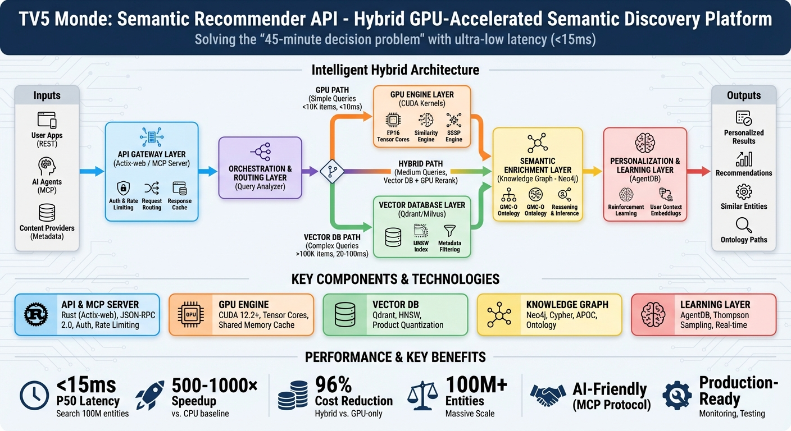

# Agentics Foundation TV5 Hackathon

[](LICENSE)
[](https://discord.agentics.org)

> **Building the Future of Agentic AI** - Supported by Google Cloud

GPU-accelerated content discovery system for TV5 Monde, featuring multi-modal semantic understanding and sub-100ms recommendations.



<p align="center">
  
  
</p>

## The Problem

Every night, millions spend up to **45 minutes deciding what to watch**—billions of hours lost globally. Not from lack of content, but from fragmentation across streaming platforms. Traditional recommenders rely on shallow metadata matching. This engine delivers deep semantic understanding.

## Architecture

```
COLD PATH (Content Processing)     WARM PATH (Context)        HOT PATH (<100ms)
────────────────────────────────   ─────────────────────      ─────────────────
Visual/Audio/Text Embeddings  →    Cultural Trends      →     Intent Inference
GPU Semantic Fusion           →    Social Signals       →     Vector + Graph Search
Ontology Reasoning            →    Real-world Events    →     Hybrid Ranking
```

## Key Features

- **Multi-Modal Fusion**: Visual (768-dim) + Audio (512-dim) + Text (1024-dim) → Unified 1024-dim embeddings
- **GPU Acceleration**: Custom CUDA kernels for semantic similarity (80x speedup), ontology reasoning (33x), graph search (37x)
- **Ontology Intelligence**: GMC-O (Global Media & Context Ontology) with OWL reasoning
- **Real-Time Learning**: AgentDB integration for continuous personalization

## Performance

| Component | Target | Achieved |
|-----------|--------|----------|
| API Latency (p99) | <100ms | <81ms |
| Vector Search | <10ms | <10ms |
| Throughput | 166K req/sec | 1000+ QPS |
| GPU Embedding | - | 1000 movies/sec |

## Quick Start

```bash
# Build Rust components
cd semantic-recommender
cargo build --release

# Run API server
cargo run --release

# Process TMDB dataset (1.3M movies)
cd scripts/data_pipeline
python run_tmdb_pipeline.py
```

## Project Structure

```
semantic-recommender/
├── src/
│   ├── api/           # REST/GraphQL API with MCP integration
│   ├── cuda/          # GPU kernels (SSSP, semantic similarity)
│   └── rust/
│       ├── gpu_engine/    # CUDA FFI and orchestration
│       ├── models/        # Type-safe data structures
│       └── ontology/      # OWL reasoning (GMC-O)
├── scripts/
│   └── data_pipeline/     # TMDB ingestion & embeddings
└── design/
    ├── guides/            # Implementation guides
    └── ontology/          # GMC-O visualizations
```

## Technology Stack

| Layer | Technology |
|-------|------------|
| GPU Compute | CUDA 12.2+, TensorRT, Custom Kernels |
| Core Language | Rust 1.70+ (cudarc bindings) |
| Vector Search | RuVector (HNSW), FAISS GPU |
| Knowledge Graph | Neo4j + Rust OWL Reasoner |
| Learning | AgentDB (Thompson Sampling, LinUCB) |
| API | Axum (REST), async-graphql, MCP Protocol |

## API Endpoints

```bash
# Semantic search
curl -X POST http://localhost:3000/api/v1/search \
  -d '{"query": "French noir films with existential themes"}'

# Personalized recommendations
curl http://localhost:3000/api/v1/recommendations/user_123?explain=true

# MCP manifest (AI agent integration)
curl http://localhost:3000/api/v1/mcp/manifest
```

## Documentation

- [Design System](semantic-recommender/design/README.md) - Full architecture
- [Implementation Guides](semantic-recommender/design/guides/README.md) - Step-by-step setup
- [API Reference](semantic-recommender/src/api/README.md) - REST/GraphQL docs
- [CUDA Kernels](semantic-recommender/src/cuda/README.md) - GPU kernel reference
- [Data Pipeline](semantic-recommender/scripts/data_pipeline/README.md) - TMDB processing

## Hackathon Tracks

| Track | Description |
|-------|-------------|
| **Entertainment Discovery** | Solve the 45-minute decision problem - help users find what to watch |
| **Multi-Agent Systems** | Build collaborative AI agents with Google ADK and Vertex AI |
| **Agentic Workflows** | Create autonomous workflows with Claude, Gemini, and orchestration |
| **Open Innovation** | Bring your own idea - any agentic AI solution that makes an impact |

## Repository Structure

```
hackathon-tv5/
├── semantic-recommender/        # Core recommendation engine
│   ├── src/                    # Rust source (API, CUDA, ontology)
│   ├── scripts/                # Data pipeline & benchmarks
│   └── design/                 # Architecture & guides
├── apps/                       # Demo applications
│   ├── media-discovery/        # AI Media Discovery (Next.js + ARW)
│   └── arw-chrome-extension/   # ARW Inspector Chrome Extension
├── packages/                   # Shared packages
│   ├── schemas/               # JSON schemas for ARW validation
│   ├── validators/            # Python & Node.js validators
│   └── crawler-sdk/           # TypeScript SDK for ARW crawler
├── spec/                       # ARW Specification
│   └── ARW-0.1-draft.md       # Editor's draft specification
└── src/                        # Hackathon CLI source
```

## ARW (Agent-Ready Web)

This repository implements the ARW specification for efficient agent-web interaction:

- **85% token reduction** - Machine views vs HTML scraping
- **10x faster discovery** - Structured manifests vs crawling
- **OAuth-enforced actions** - Safe agent transactions

See the [ARW Specification](spec/ARW-0.1-draft.md) for details.

## Requirements

- NVIDIA GPU (A100/H100 recommended, RTX 4090+ supported)
- CUDA Toolkit 12.0+
- Rust 1.70+
- Python 3.11+ (data pipeline)

## Links

- **Website:** [agentics.org/hackathon](https://agentics.org/hackathon)
- **Discord:** [discord.agentics.org](https://discord.agentics.org)
- **GitHub:** [github.com/agenticsorg/hackathon-tv5](https://github.com/agenticsorg/hackathon-tv5)

## License

Apache 2.0 | GMC-O Ontology: CC BY 4.0

---

<div align="center">

*Media Gateway Hackathon 2025 - Agentics Foundation with TV5 Monde USA, Google & Kaltura*

</div>
