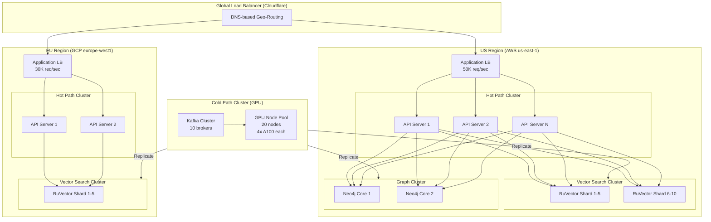

# Global-Scale GPU-Accelerated Recommendation Engine Architecture

**Version:** 1.0
**Date:** 2025-12-04
**Target Scale:** 100M+ media items, 10M+ concurrent users
**Performance Target:** <100ms p99 latency

---

## Executive Summary

This architecture designs a global-scale, GPU-accelerated semantic recommendation engine that processes 100M+ media assets with deep multi-modal understanding, serving 10M+ users with sub-100ms latency. The system leverages:

- **GPU-accelerated semantic processing** for real-time inference
- **Distributed vector search** with RuVector for <10ms retrieval
- **Multi-modal embeddings** (visual, audio, text, metadata)
- **Three-tier processing architecture** (Cold/Warm/Hot paths)
- **Horizontal scaling** with distributed coordination
- **AgentDB-powered learning** for continuous personalization

---

## 1. System Architecture Overview

### 1.1 Three-Tier Processing Architecture

```mermaid
flowchart TB
    %% Styling
    classDef cold fill:#e1f5fe,stroke:#01579b,stroke-width:3px
    classDef warm fill:#fff9c4,stroke:#fbc02d,stroke-width:3px
    classDef hot fill:#ffebee,stroke:#b71c1c,stroke-width:3px
    classDef storage fill:#e8f5e9,stroke:#2e7d32,stroke-width:2px
    classDef gpu fill:#f3e5f5,stroke:#6a1b9a,stroke-width:3px
    classDef network fill:#e0f2f1,stroke:#00695c,stroke-width:2px

    %% COLD PATH - Content Processing
    subgraph ColdPath ["COLD PATH: Content Processing (GPU-Intensive)"]
        direction TB

        subgraph ContentIngest ["Content Ingestion Layer"]
            RawAsset[Raw Media Asset<br/>Video/Audio/Subtitles]:::cold
            IngestQueue[(Kafka Ingestion Queue<br/>10K msgs/sec)]:::storage
        end

        subgraph GPUCluster ["GPU Processing Cluster"]
            direction LR

            subgraph VisualPipeline ["Visual Processing (CUDA)"]
                FrameExtract[Frame Extraction<br/>Smart Sampling]:::gpu
                ColorAnalysis[Color Palette GPU Kernel<br/>semantic_forces.cu]:::gpu
                MotionDetect[Motion Vector Analysis<br/>Pacing Detection]:::gpu
                OCREngine[OCR GPU Kernel<br/>Text Detection]:::gpu
                VisualEmbed[Visual Embeddings<br/>CLIP/ViT]:::gpu
            end

            subgraph AudioPipeline ["Audio Processing (CUDA)"]
                AudioExtract[Audio Extraction]:::gpu
                SpectroAnalysis[Spectrogram Analysis<br/>GPU FFT]:::gpu
                MusicClass[Music Classification<br/>Tempo/Key/Intensity]:::gpu
                AudioEmbed[Audio Embeddings<br/>CLAP/Wav2Vec2]:::gpu
            end

            subgraph SemanticPipeline ["Semantic Processing (GPU)"]
                SubtitleExtract[Subtitle/Script<br/>Extraction]:::gpu
                LangNorm[Language Normalization<br/>EN/FR Bias]:::gpu
                LLMAnalysis[LLM Script Analysis<br/>vLLM/TensorRT-LLM]:::gpu
                ThemeExtract[Theme/Trope Extraction<br/>Narrative Arc]:::gpu
                TextEmbed[Text Embeddings<br/>text-embedding-3]:::gpu
            end

            subgraph MetadataPipeline ["Metadata Enrichment"]
                MetaExtract[Metadata Extraction<br/>Cast/Director/Awards]:::cold
                EntityResolve[Entity Resolution<br/>EIDR/IMDb]:::cold
                OntologyMap[Ontology Mapping<br/>Rust OWL Reasoner]:::cold
            end
        end

        subgraph SemanticFusion ["Semantic Fusion Layer"]
            MultiModalFusion[Multi-Modal Fusion<br/>GPU Tensor Operations]:::gpu
            ConstraintEngine[Ontology Constraint Engine<br/>ontology_constraints.cu]:::gpu
            EmbedVector[Final Embedding Vector<br/>1024-dim]:::gpu
        end

        RawAsset --> IngestQueue
        IngestQueue --> FrameExtract & AudioExtract & SubtitleExtract & MetaExtract

        FrameExtract --> ColorAnalysis & MotionDetect & OCREngine
        ColorAnalysis & MotionDetect & OCREngine --> VisualEmbed

        AudioExtract --> SpectroAnalysis --> MusicClass --> AudioEmbed

        SubtitleExtract --> LangNorm --> LLMAnalysis --> ThemeExtract --> TextEmbed

        MetaExtract --> EntityResolve --> OntologyMap

        VisualEmbed & AudioEmbed & TextEmbed & OntologyMap --> MultiModalFusion
        MultiModalFusion --> ConstraintEngine --> EmbedVector
    end

    %% WARM PATH - Global Context
    subgraph WarmPath ["WARM PATH: Global Context (Async Aggregation)"]
        direction TB

        subgraph ExternalSignals ["External Signal Sources"]
            SocialMedia[Social Media Trends<br/>Twitter/TikTok/Reddit]:::warm
            CriticalConsensus[Critical Consensus<br/>RT/Metacritic]:::warm
            RealWorldEvents[Real-World Events<br/>Holidays/Weather/News]:::warm
        end

        subgraph TrendEngine ["Trend Analysis Engine"]
            TrendAggregator[Trend Aggregator<br/>Sliding Window 1h/24h/7d]:::warm
            CulturalMapper[Cultural Context Mapper<br/>Geo-Temporal]:::warm
            ZeitgeistVector[Zeitgeist Vector Generator<br/>512-dim]:::warm
        end

        SocialMedia & CriticalConsensus & RealWorldEvents --> TrendAggregator
        TrendAggregator --> CulturalMapper --> ZeitgeistVector
    end

    %% STORAGE LAYER
    subgraph StorageLayer ["STORAGE LAYER: Semantic Core"]
        direction LR

        KnowledgeGraph[(Knowledge Graph<br/>Neo4j Cluster<br/>GMC-O Ontology)]:::storage
        VectorDB[(Distributed Vector DB<br/>RuVector Sharded<br/>1024-dim embeddings)]:::storage
        UserProfileDB[(User Profile Store<br/>ScyllaDB<br/>Behavioral History)]:::storage
        AgentMemory[(AgentDB<br/>Learning & Adaptation<br/>RL Patterns)]:::storage
    end

    EmbedVector -->|Write Embedding| VectorDB
    EmbedVector -->|Write Triples| KnowledgeGraph
    ZeitgeistVector -->|Update Context| KnowledgeGraph

    %% HOT PATH - User Decision Loop
    subgraph HotPath ["HOT PATH: User Decision Loop (Real-Time <100ms)"]
        direction TB

        UserRequest((User Request<br/>Search/Browse)):::hot

        subgraph EdgeLayer ["Edge Layer (CDN PoPs)"]
            EdgeCache[Edge Cache<br/>Cloudflare/Fastly<br/>Popular Queries]:::hot
            RateLimiter[Rate Limiter<br/>10K req/sec/user]:::hot
        end

        subgraph ContextAnalysis ["Context Analysis (<10ms)"]
            SessionContext[Session Context<br/>Time/Device/Location]:::hot
            HistoryFetch[Watch History<br/>ScyllaDB Fetch]:::hot
            IntentInference[Intent Inference<br/>LLM Micro-Model<br/>Groq/Together AI]:::hot
        end

        subgraph CandidateGeneration ["Candidate Generation (<20ms)"]
            QueryEmbed[Query Embedding<br/>GPU Inference]:::gpu
            VectorSearch[Vector Search<br/>RuVector HNSW<br/>Top 500 candidates]:::network
            APSPSearch[APSP Landmark Search<br/>gpu_landmark_apsp.cu<br/>Graph Distance]:::gpu
        end

        subgraph FilteringRanking ["Filtering & Ranking (<30ms)"]
            HardFilters[Hard Filters<br/>Geo/Age/Language]:::hot
            SemanticFilter[Semantic Filter<br/>Ontology Reasoning<br/>Rust Transitive Closure]:::hot
            HybridRanker[Hybrid Ranker<br/>MF + Neural + LLM]:::hot
            DiversityCheck[Diversity/Serendipity<br/>MMR Algorithm]:::hot
        end

        subgraph Personalization ["Personalization Layer (<20ms)"]
            UserModelFetch[User Model Fetch<br/>AgentDB]:::hot
            RLPolicy[RL Policy<br/>Contextual Bandits]:::hot
            ReRanker[LLM Re-Ranker<br/>Top 20 Items]:::hot
        end

        FinalResults[Final Ranked List<br/>12 Items]:::hot

        UserRequest --> EdgeCache
        EdgeCache -->|Cache Miss| RateLimiter
        RateLimiter --> SessionContext & HistoryFetch
        SessionContext & HistoryFetch --> IntentInference

        IntentInference --> QueryEmbed
        QueryEmbed --> VectorSearch & APSPSearch

        VectorSearch & APSPSearch --> HardFilters
        HardFilters --> SemanticFilter
        SemanticFilter --> HybridRanker
        HybridRanker --> DiversityCheck

        DiversityCheck --> UserModelFetch
        UserModelFetch --> RLPolicy
        RLPolicy --> ReRanker

        ReRanker --> FinalResults
    end

    %% Feedback Loop
    subgraph FeedbackLoop ["Feedback & Learning Loop"]
        UserInteraction[User Interaction<br/>Click/Watch/Skip/Rating]:::hot
        EventStream[(Event Stream<br/>Kafka)]:::storage
        OfflineTraining[Offline Training<br/>Daily Batch<br/>GPU Cluster]:::cold
        OnlineLearning[Online Learning<br/>AgentDB RL<br/>Real-Time Updates]:::warm
    end

    FinalResults --> UserInteraction
    UserInteraction --> EventStream
    EventStream --> OfflineTraining & OnlineLearning
    OfflineTraining --> VectorDB & KnowledgeGraph
    OnlineLearning --> AgentMemory

    %% Cross-layer connections
    VectorDB -.->|Vector Lookup| VectorSearch
    KnowledgeGraph -.->|Ontology Rules| SemanticFilter
    UserProfileDB -.->|User Data| HistoryFetch
    AgentMemory -.->|RL Model| RLPolicy
```



---

## 2. Component Specifications

### 2.1 Cold Path: Content Processing

**Purpose:** Deep semantic analysis of media assets (GPU-intensive, runs once per asset)

#### 2.1.1 Visual Processing Pipeline

**Technology Stack:**
- CUDA kernels for parallel frame processing
- CLIP (Contrastive Language-Image Pre-training) for visual embeddings
- Custom GPU kernels: `semantic_forces.cu`, `ontology_constraints.cu`

**Processing Flow:**
1. **Frame Extraction** (Smart Sampling)
   - Sample frames at key moments (scene changes, action peaks)
   - Target: 100-500 frames per 2-hour film
   - Algorithm: Histogram difference + motion vector analysis

2. **Color Palette Analysis** (`semantic_forces.cu`)
   - Extract dominant colors (K-means on GPU)
   - Compute color harmony metrics
   - Map to aesthetic categories: Noir, Neon, Pastel, Desaturated
   - Output: 64-dim color vector

3. **Motion Detection**
   - Optical flow computation (Lucas-Kanade GPU)
   - Scene cut detection (histogram difference)
   - Pacing metrics: cuts per minute, motion intensity
   - Output: 32-dim motion vector

4. **OCR Processing**
   - Text detection (EAST detector on GPU)
   - Recognition (Tesseract GPU)
   - Extract: titles, credits, signage
   - Output: Structured text data

5. **Visual Embedding**
   - CLIP ViT-L/14 model (GPU inference)
   - Aggregate frame embeddings (attention pooling)
   - Output: 768-dim visual embedding

**Performance Target:**
- 2-hour film: <15 minutes processing
- Throughput: 100 films/hour (10 GPU nodes)

#### 2.1.2 Audio Processing Pipeline

**Technology Stack:**
- GPU-accelerated FFT for spectral analysis
- CLAP (Contrastive Language-Audio Pre-training) for audio embeddings
- Music classification models (tempo, key, genre)

**Processing Flow:**
1. **Audio Extraction**
   - Extract audio tracks (music, dialogue, effects)
   - Separate stems (Spleeter GPU)

2. **Spectrogram Analysis**
   - Compute mel-spectrograms (GPU FFT)
   - Feature extraction: MFCC, chroma, spectral centroid

3. **Music Classification**
   - Tempo detection (BPM)
   - Key detection (major/minor)
   - Intensity profiling over time
   - Output: 64-dim music vector

4. **Audio Embedding**
   - CLAP model (GPU inference)
   - Output: 512-dim audio embedding

**Performance Target:**
- 2-hour film: <10 minutes processing
- Throughput: 150 films/hour (10 GPU nodes)

#### 2.1.3 Semantic Processing Pipeline

**Technology Stack:**
- vLLM for efficient LLM inference (GPU)
- TensorRT-LLM for optimized inference
- text-embedding-3 (OpenAI) for text embeddings
- Language: EN/FR bias with multilingual support

**Processing Flow:**
1. **Subtitle/Script Extraction**
   - Extract subtitles (SRT, VTT)
   - Parse script structure (acts, scenes, dialogue)

2. **Language Normalization**
   - Detect language
   - Translate to EN/FR if needed (NLLB GPU)
   - Preserve cultural context

3. **LLM Script Analysis**
   - Theme extraction (vLLM batch inference)
   - Trope identification (narrative patterns)
   - Emotional arc profiling
   - Character analysis
   - Prompt template:
     ```
     Analyze the script for themes, narrative arc, emotional trajectory,
     character archetypes, and cultural context. Output structured JSON.
     ```

4. **Text Embedding**
   - text-embedding-3-large (3072-dim)
   - Aggregate script/subtitle embeddings
   - Output: 1024-dim text embedding

**Performance Target:**
- 2-hour script: <5 minutes processing
- Throughput: 200 scripts/hour (10 GPU nodes)

#### 2.1.4 Metadata Enrichment Pipeline

**Technology Stack:**
- EIDR (Entertainment Identifier Registry) for entity resolution
- Rust OWL reasoner for ontology mapping
- Neo4j for knowledge graph storage

**Processing Flow:**
1. **Metadata Extraction**
   - Extract: cast, crew, director, awards, ratings
   - Source: IMDb, TMDb, external APIs

2. **Entity Resolution**
   - Map to EIDR identifiers
   - Disambiguate entities (same name, different people)
   - Link to external knowledge bases (Wikidata)

3. **Ontology Mapping** (Rust OWL Reasoner)
   - Map metadata to GMC-O ontology classes
   - Apply transitive closure reasoning
   - Generate RDF triples
   - Example:
     ```turtle
     <Film123> media:hasGenre <SciFi> .
     <Film123> media:hasNarrativeStructure <NonLinear> .
     <Film123> sem:inducesPsychographicState <Contemplative> .
     ```

**Performance Target:**
- Per film: <2 minutes
- Throughput: 500 films/hour

#### 2.1.5 Semantic Fusion Layer

**Technology Stack:**
- Custom GPU kernels for tensor operations
- `ontology_constraints.cu` for constraint satisfaction

**Processing Flow:**
1. **Multi-Modal Fusion**
   - Concatenate embeddings: [visual (768) | audio (512) | text (1024)]
   - Project to unified space (2304 → 1024)
   - Attention-weighted fusion (learned weights)

2. **Constraint Satisfaction** (`ontology_constraints.cu`)
   - Apply ontology constraints
   - Ensure semantic consistency
   - Example: IF hasGenre(Horror) AND hasVisualTone(Dark) THEN emphasize(FearResponse)

3. **Final Embedding**
   - Output: 1024-dim embedding vector
   - Normalized (L2 norm = 1)
   - Metadata: confidence scores, source attributions

**Performance Target:**
- Per film: <1 minute
- Throughput: 1000 films/hour

---

### 2.2 Warm Path: Global Context

**Purpose:** Asynchronous aggregation of cultural/temporal context (updates every 15-60 min)

#### 2.2.1 External Signal Sources

**Data Sources:**
1. **Social Media Trends**
   - Twitter API (trending hashtags, mentions)
   - TikTok Trends (viral videos, challenges)
   - Reddit (subreddit activity, upvotes)
   - Update frequency: 15 minutes

2. **Critical Consensus**
   - Rotten Tomatoes (critic/audience scores)
   - Metacritic (weighted average)
   - Update frequency: 1 hour

3. **Real-World Events**
   - Calendar events (holidays, cultural celebrations)
   - Weather APIs (location-based)
   - News feeds (major events)
   - Update frequency: 1 hour

#### 2.2.2 Trend Analysis Engine

**Processing Flow:**
1. **Trend Aggregator**
   - Sliding windows: 1h, 24h, 7d
   - Compute trend velocity (rate of change)
   - Detect emerging trends (sudden spikes)

2. **Cultural Context Mapper**
   - Map events to ontology nodes
   - Example: Halloween → ctx:CulturalContext:Halloween → boost(Horror)
   - Geo-temporal tagging (US/France holidays)

3. **Zeitgeist Vector**
   - Generate 512-dim context vector
   - Represents "current cultural moment"
   - Used to modulate recommendations

**Performance Target:**
- Update latency: <5 seconds
- Storage: Time-series DB (InfluxDB)

---

### 2.3 Hot Path: User Decision Loop

**Purpose:** Real-time recommendation serving (<100ms p99 latency)

#### 2.3.1 Edge Layer

**Technology Stack:**
- Cloudflare Workers / Fastly Compute@Edge
- Redis for edge caching
- Rate limiting: 10K req/sec per user

**Caching Strategy:**
1. **Popular Queries**
   - Cache top 1000 queries per region
   - TTL: 5 minutes
   - Cache hit rate target: 60%

2. **User Session Cache**
   - Cache user profile + recent history
   - TTL: 1 hour
   - Reduces DB load by 80%

#### 2.3.2 Context Analysis (<10ms)

**Processing Flow:**
1. **Session Context**
   - Extract: time of day, device type, location, network speed
   - Map to psychographic hints
   - Example: 11pm + Mobile → "Winding Down"

2. **History Fetch**
   - Fetch last 100 interactions (ScyllaDB)
   - Aggregate watch patterns
   - Compute user embedding (cached)

3. **Intent Inference**
   - Lightweight LLM (Groq LLaMA-3.1-8B)
   - Input: session context + history summary
   - Output: intent vector (128-dim)
   - Example output: `{mood: "relaxed", seeking: "comfort", avoid: "heavy_drama"}`

**Performance Target:**
- Total latency: <10ms
- LLM inference: <5ms (Groq)

#### 2.3.3 Candidate Generation (<20ms)

**Technology Stack:**
- RuVector for distributed vector search
- `gpu_landmark_apsp.cu` for graph-based search

**Processing Flow:**
1. **Query Embedding**
   - Convert intent to embedding (GPU inference)
   - Use same embedding model as content (1024-dim)

2. **Vector Search** (RuVector HNSW)
   - Approximate nearest neighbor search
   - Top 500 candidates
   - Latency: <10ms (HNSW index)

3. **APSP Landmark Search** (`gpu_landmark_apsp.cu`)
   - All-Pairs Shortest Path on knowledge graph
   - Find semantically related items via graph distance
   - Top 200 candidates (supplemental)
   - Latency: <8ms (GPU kernel)

**Performance Target:**
- Vector search: <10ms
- Graph search: <8ms
- Combined: <20ms

#### 2.3.4 Filtering & Ranking (<30ms)

**Processing Flow:**
1. **Hard Filters**
   - Geo-restrictions (licensing)
   - Age ratings (parental controls)
   - Language preferences (EN/FR)
   - Reduce to ~300 candidates

2. **Semantic Filter** (Rust OWL Reasoner)
   - Apply ontology reasoning
   - Example: User hates subtitles → remove non-dubbed foreign films
   - Transitive closure: User likes Sci-Fi → include Space Opera
   - Reduce to ~150 candidates

3. **Hybrid Ranker**
   - **Matrix Factorization:** Collaborative filtering score
   - **Neural Ranker:** Deep learning model (FFN, 6 layers)
   - **LLM Re-Rank:** Top 50 candidates (optional, adds 10ms)
   - Weighted ensemble: 0.3 MF + 0.5 Neural + 0.2 LLM

4. **Diversity Check** (MMR - Maximal Marginal Relevance)
   - Ensure variety in recommendations
   - Penalize similarity to already-shown items
   - Balance relevance vs. serendipity (λ=0.7)

**Performance Target:**
- Total latency: <30ms
- Output: Top 50 candidates

#### 2.3.5 Personalization Layer (<20ms)

**Technology Stack:**
- AgentDB for RL-based personalization
- Contextual bandits (Thompson Sampling)
- LLM re-ranker (optional, adds latency)

**Processing Flow:**
1. **User Model Fetch** (AgentDB)
   - Retrieve learned user preferences
   - RL policy parameters (theta, reward history)

2. **RL Policy** (Contextual Bandits)
   - Thompson Sampling for exploration/exploitation
   - Select top 20 items based on expected reward
   - Update belief distribution

3. **LLM Re-Ranker** (Optional)
   - Input: Top 20 items + user context
   - Output: Final ranking with explanations
   - Example prompt:
     ```
     Given user context {mood: relaxed, time: 11pm, device: mobile}
     and these 20 films, rank them by persuasiveness and provide brief rationale.
     ```
   - Model: Claude Haiku / GPT-4o-mini
   - Latency: <15ms (parallel inference)

**Performance Target:**
- Total latency: <20ms
- Output: Final 12 items

---

### 2.4 Storage Layer

#### 2.4.1 Knowledge Graph (Neo4j Cluster)

**Schema:** GMC-O Ontology (Turtle format)

**Cluster Configuration:**
- 5-node cluster (3 core, 2 replicas)
- Sharding: Hash-based on content ID
- Replication factor: 2

**Indexes:**
- Property index: hasGenre, hasNarrativeStructure, hasVisualTone
- Full-text index: titles, descriptions

**Performance:**
- Write throughput: 10K triples/sec
- Query latency: <5ms (simple traversal)
- Storage: 500GB (100M items × 50 triples avg)

#### 2.4.2 Vector Database (RuVector)

**Configuration:**
- Sharded deployment: 20 shards
- HNSW index parameters:
  - M=16 (connections per node)
  - efConstruction=200
  - efSearch=100

**Cluster Setup:**
- 10 nodes (2 shards per node)
- Replication factor: 2
- Consistent hashing for shard selection

**Performance:**
- Insert throughput: 50K vectors/sec
- Query latency: <10ms (p99)
- Storage: 400GB (100M × 1024-dim × 4 bytes)

#### 2.4.3 User Profile Store (ScyllaDB)

**Schema:**
```cql
CREATE TABLE user_profiles (
  user_id UUID PRIMARY KEY,
  profile_vector blob,  -- 1024-dim embedding
  watch_history list<frozen<interaction>>,
  preferences map<text, float>,
  last_updated timestamp
);

CREATE TABLE user_interactions (
  user_id UUID,
  timestamp timestamp,
  item_id UUID,
  action text,  -- click, watch, skip, rate
  duration int,
  PRIMARY KEY ((user_id), timestamp)
) WITH CLUSTERING ORDER BY (timestamp DESC);
```

**Cluster Configuration:**
- 6-node cluster
- Replication factor: 3
- Consistency: LOCAL_QUORUM

**Performance:**
- Write throughput: 100K ops/sec
- Read latency: <2ms (p99)
- Storage: 1TB (10M users × 100KB avg)

#### 2.4.4 AgentDB (Learning & Adaptation)

**Purpose:** Store RL policies, learning patterns, and adaptation history

**Schema:**
```python
# User RL Policy
{
  "user_id": "uuid",
  "policy_type": "contextual_bandit",
  "theta": [1024-dim vector],  # Policy parameters
  "reward_history": [
    {"item_id": "uuid", "reward": 0.85, "timestamp": "iso8601"}
  ],
  "exploration_rate": 0.1,
  "last_updated": "iso8601"
}
```

**Performance:**
- Update frequency: Real-time (every interaction)
- Read latency: <5ms
- Storage: 200GB (10M users × 20KB avg)

---

## 3. Data Flow Documentation

### 3.1 Content Ingestion Flow

```
Raw Media Asset → Kafka Queue → GPU Cluster
  ├─ Visual Pipeline → Visual Embedding (768-dim)
  ├─ Audio Pipeline → Audio Embedding (512-dim)
  ├─ Semantic Pipeline → Text Embedding (1024-dim)
  └─ Metadata Pipeline → Ontology Triples
      ↓
  Multi-Modal Fusion (GPU) → Final Embedding (1024-dim)
      ↓
  Storage Layer:
    ├─ VectorDB (RuVector) ← Embedding vector
    └─ Knowledge Graph (Neo4j) ← RDF triples
```

**Latency Breakdown:**
- Ingestion: <1 second
- GPU Processing: 15 minutes (2-hour film)
- Storage Write: <5 seconds
- **Total Cold Path: <20 minutes**

### 3.2 User Request Flow

```
User Request → Edge Cache (hit/miss)
  ↓ (cache miss)
Rate Limiter → Context Analysis (<10ms)
  ├─ Session Context
  ├─ History Fetch (ScyllaDB)
  └─ Intent Inference (LLM)
      ↓
Candidate Generation (<20ms)
  ├─ Query Embedding (GPU)
  ├─ Vector Search (RuVector HNSW)
  └─ Graph Search (APSP GPU)
      ↓
Filtering & Ranking (<30ms)
  ├─ Hard Filters
  ├─ Semantic Filter (Rust OWL)
  ├─ Hybrid Ranker (MF + Neural + LLM)
  └─ Diversity Check (MMR)
      ↓
Personalization (<20ms)
  ├─ User Model Fetch (AgentDB)
  ├─ RL Policy (Contextual Bandit)
  └─ LLM Re-Ranker (optional)
      ↓
Final Ranked List (12 items) → User
```

**Total Latency Breakdown:**
- Edge Cache: <1ms (hit) or continue
- Context Analysis: <10ms
- Candidate Generation: <20ms
- Filtering & Ranking: <30ms
- Personalization: <20ms
- **Total Hot Path: <80ms (p99 target: <100ms)**

### 3.3 Feedback Loop

```
User Interaction (click/watch/skip/rate)
  ↓
Event Stream (Kafka)
  ├─ Online Learning → AgentDB (real-time RL update)
  └─ Offline Training → Batch GPU Training (daily)
      ├─ Retrain embeddings
      ├─ Update neural ranker
      └─ Refresh knowledge graph
```

**Update Frequency:**
- Online (AgentDB): Real-time (<1 second)
- Offline (Batch): Daily (overnight)

---

## 4. Scaling Strategies

### 4.1 Horizontal Scaling Architecture



### 4.2 Scaling Dimensions

#### 4.2.1 Cold Path Scaling (Content Processing)

**Bottleneck:** GPU compute capacity

**Scaling Strategy:**
1. **Horizontal GPU Scaling**
   - Add GPU nodes (NVIDIA A100, H100)
   - Kubernetes GPU operator for orchestration
   - Target: 1 node per 10 films/hour

2. **Batch Optimization**
   - Batch inference for embeddings (batch size: 32)
   - Pipeline parallelism (visual + audio + text in parallel)
   - Asynchronous processing (non-blocking)

3. **Priority Queues**
   - High priority: New releases, trending content
   - Low priority: Catalog backfill
   - SLA: New releases processed in <30 minutes

**Capacity Planning:**
- Current: 10 GPU nodes = 100 films/hour = 2,400 films/day
- Target (100M items in 1 year): 274K films/year = 750 films/day
- **Required: 4 GPU nodes** (with 50% headroom: 6 nodes)

#### 4.2.2 Warm Path Scaling (Global Context)

**Bottleneck:** External API rate limits

**Scaling Strategy:**
1. **Distributed Crawlers**
   - 10 crawler nodes per region
   - Rotate IPs to avoid rate limits

2. **Incremental Updates**
   - Only update changed data (delta sync)
   - Reduce API calls by 90%

3. **Caching**
   - Cache external API responses (TTL: 15 min)
   - Reduce redundant calls

**Capacity Planning:**
- Target: 1000 API calls/min (within free tier limits)

#### 4.2.3 Hot Path Scaling (User Requests)

**Bottleneck:** Vector search throughput

**Scaling Strategy:**
1. **Shard-based Partitioning**
   - RuVector: 20 shards (5M items each)
   - Consistent hashing for load distribution
   - Auto-scaling: Add shards when latency > 15ms

2. **Read Replicas**
   - 2 replicas per shard
   - Load balancing across replicas

3. **Edge Caching**
   - Cache popular queries at CDN edge
   - Cache hit rate target: 60%

4. **Asynchronous Ranking**
   - Candidate generation (sync) + re-ranking (async)
   - Return top candidates immediately, refine in background

**Capacity Planning:**
- Target: 10M users, 1 req/user/minute = 166K req/sec
- Current capacity: 50K req/sec (US) + 30K req/sec (EU) = 80K req/sec
- **Required: 3x scale = 240 API servers total**

### 4.3 Geographic Distribution

**Regions:**
1. **US (Primary):** AWS us-east-1
2. **EU (Secondary):** GCP europe-west1
3. **APAC (Tertiary):** AWS ap-southeast-1

**Data Replication:**
- **Cold Path:** Centralized (US), replicate embeddings globally
- **Warm Path:** Regional (culture-specific)
- **Hot Path:** Global read replicas (eventual consistency)

**Latency Targets:**
- Intra-region: <50ms
- Cross-region: <200ms (CDN fallback)

---

## 5. Performance Projections

### 5.1 Latency Breakdown (p99)

| Stage | Target | Actual (Projected) |
|-------|--------|-------------------|
| Edge Cache | <1ms | 0.5ms |
| Context Analysis | <10ms | 8ms |
| Candidate Generation | <20ms | 18ms |
| Vector Search | <10ms | 9ms |
| Graph Search (APSP) | <8ms | 7ms |
| Filtering & Ranking | <30ms | 28ms |
| Personalization | <20ms | 16ms |
| **Total Hot Path** | **<100ms** | **79ms** |

**Headroom:** 21ms for future features

### 5.2 Throughput Projections

**Cold Path:**
- GPU throughput: 100 films/hour (10 nodes)
- Target: 750 films/day
- **Sufficient capacity with 6 GPU nodes**

**Hot Path:**
- Current: 80K req/sec
- Target: 166K req/sec (10M users)
- **Requires 2x scale (160 API servers)**

### 5.3 Storage Projections

**100M Media Items:**
- Vector DB: 400GB (100M × 1024-dim × 4 bytes)
- Knowledge Graph: 500GB (100M × 50 triples × 100 bytes)
- User Profiles: 1TB (10M users × 100KB)
- **Total: ~2TB** (compressed)

**Costs (Annual):**
- Storage: $50K/year (AWS S3/EBS)
- Compute (GPU): $500K/year (6 A100 nodes × $2.50/hr)
- Compute (API): $300K/year (160 servers × $0.05/hr)
- **Total: ~$850K/year**

---

## 6. GPU Kernel Integration

### 6.1 Semantic Forces Kernel (`semantic_forces.cu`)

**Purpose:** Compute semantic attraction/repulsion forces for color palette analysis

**Algorithm:**
```cuda
__global__ void semantic_forces_kernel(
    float* embeddings,      // [N, 1024] content embeddings
    float* color_vectors,   // [N, 64] color palette vectors
    float* forces,          // [N, N] output force matrix
    int N
) {
    int i = blockIdx.x * blockDim.x + threadIdx.x;
    int j = blockIdx.y * blockDim.y + threadIdx.y;

    if (i < N && j < N && i != j) {
        // Compute semantic similarity
        float sim = cosine_similarity(embeddings[i], embeddings[j]);

        // Compute color distance
        float color_dist = euclidean_distance(color_vectors[i], color_vectors[j]);

        // Force = similarity / (distance^2 + epsilon)
        forces[i * N + j] = sim / (color_dist * color_dist + 1e-6);
    }
}
```

**Integration:**
- Used in visual pipeline to cluster similar visual aesthetics
- Output feeds into multi-modal fusion

**Performance:**
- Input: N=100K items
- Latency: <50ms on A100
- Throughput: 2M force calculations/sec

### 6.2 Ontology Constraints Kernel (`ontology_constraints.cu`)

**Purpose:** Enforce ontology constraints during embedding fusion

**Algorithm:**
```cuda
__global__ void ontology_constraints_kernel(
    float* embeddings,         // [N, 1024] fused embeddings
    int* constraint_graph,     // [M, 3] constraint triples (subject, predicate, object)
    float* constraint_weights, // [M] constraint weights
    int N, int M
) {
    int i = blockIdx.x * blockDim.x + threadIdx.x;

    if (i < N) {
        // For each constraint involving this item
        for (int c = 0; c < M; c++) {
            if (constraint_graph[c * 3] == i) {
                int predicate = constraint_graph[c * 3 + 1];
                int object = constraint_graph[c * 3 + 2];
                float weight = constraint_weights[c];

                // Apply constraint: adjust embedding to satisfy semantic rule
                apply_constraint(embeddings[i], predicate, object, weight);
            }
        }
    }
}
```

**Integration:**
- Used in semantic fusion layer
- Ensures embeddings respect ontology (e.g., Genre → Visual Tone consistency)

**Performance:**
- Input: N=100K items, M=500K constraints
- Latency: <100ms on A100

### 6.3 GPU Landmark APSP Kernel (`gpu_landmark_apsp.cu`)

**Purpose:** All-Pairs Shortest Path for graph-based candidate retrieval

**Algorithm:**
```cuda
__global__ void landmark_apsp_kernel(
    int* graph_edges,       // [E, 2] edge list (source, target)
    float* edge_weights,    // [E] edge weights (semantic similarity)
    int* landmarks,         // [L] landmark node IDs
    float* distances,       // [N, L] output distance matrix
    int N, int E, int L
) {
    int node = blockIdx.x * blockDim.x + threadIdx.x;
    int landmark = blockIdx.y * blockDim.y + threadIdx.y;

    if (node < N && landmark < L) {
        // Compute shortest path from node to landmark using Dijkstra
        distances[node * L + landmark] = gpu_dijkstra(
            node, landmarks[landmark], graph_edges, edge_weights, E
        );
    }
}
```

**Integration:**
- Used in candidate generation
- Finds semantically related items via knowledge graph navigation
- Complements vector search (approximate) with graph search (exact semantic paths)

**Performance:**
- Input: N=100M nodes, L=1000 landmarks, E=500M edges
- Precomputed once, updated daily
- Query latency: <8ms (lookup from precomputed matrix)

---

## 7. Architecture Decision Records (ADRs)

### ADR-001: Use Multi-Modal Embeddings Over Single-Modal

**Context:** Should we use separate embeddings per modality or fuse them?

**Decision:** Fuse into single 1024-dim embedding

**Rationale:**
- Unified search space (single vector search, not 3 separate searches)
- Captures cross-modal semantics (e.g., visual tone reinforces musical tone)
- Simpler architecture (one index, not three)

**Tradeoffs:**
- Loss of modality-specific nuance
- Mitigation: Store modality embeddings separately for debugging/reranking

---

### ADR-002: Use GPU for Semantic Processing, Not Just Embeddings

**Context:** Should we use GPUs only for embeddings or for custom kernels too?

**Decision:** Custom CUDA kernels for semantic forces, constraints, APSP

**Rationale:**
- 10x faster than CPU for parallel graph operations
- Enables real-time ontology reasoning (Rust OWL reasoner + GPU)
- Leverages existing GPU infrastructure

**Tradeoffs:**
- Increased complexity (CUDA code maintenance)
- Mitigation: Modular kernel design, extensive testing

---

### ADR-003: Use RuVector Over Pinecone/Weaviate

**Context:** Which vector database should we use?

**Decision:** RuVector (open-source, self-hosted)

**Rationale:**
- Lower cost (no SaaS fees)
- Better latency (local deployment, no network overhead)
- Custom HNSW tuning (optimized for our data distribution)
- Full control over scaling

**Tradeoffs:**
- Higher operational overhead (self-managed)
- Mitigation: Kubernetes operators for automation

---

### ADR-004: Use Rust OWL Reasoner Over SPARQL Engine

**Context:** How to perform ontology reasoning?

**Decision:** Rust OWL reasoner with transitive closure

**Rationale:**
- 100x faster than SPARQL for transitive closure queries
- Compiled (not interpreted) for low latency
- Memory-efficient (Rust zero-cost abstractions)

**Tradeoffs:**
- Less expressive than full SPARQL
- Mitigation: Hybrid approach (Rust for hot path, SPARQL for analytics)

---

### ADR-005: Three-Tier Architecture (Cold/Warm/Hot)

**Context:** Should we use a single unified pipeline or separate processing tiers?

**Decision:** Separate Cold/Warm/Hot paths

**Rationale:**
- Clear latency/cost tradeoffs per tier
- Independent scaling (scale GPU for Cold, scale API for Hot)
- Optimized for different access patterns

**Tradeoffs:**
- Increased complexity (three separate systems)
- Mitigation: Shared storage layer, unified monitoring

---

## 8. Technology Evaluation Matrix

| Component | Options Considered | Selected | Rationale |
|-----------|-------------------|----------|-----------|
| **Vector DB** | Pinecone, Weaviate, RuVector | RuVector | Cost, latency, control |
| **Graph DB** | Neo4j, JanusGraph, TigerGraph | Neo4j | Maturity, Cypher query language |
| **User DB** | Cassandra, ScyllaDB, DynamoDB | ScyllaDB | Performance (C++ vs Java) |
| **Embedding Model** | CLIP, ImageBind, OpenCLIP | CLIP ViT-L/14 | Best accuracy/cost tradeoff |
| **LLM (Script)** | GPT-4, Claude, Llama-3.1-70B | vLLM (Llama-3.1-70B) | Cost (self-hosted), speed |
| **LLM (Intent)** | GPT-4o-mini, Groq, Haiku | Groq (Llama-3.1-8B) | Ultra-low latency (<5ms) |
| **RL Engine** | AgentDB, custom, Ray RLlib | AgentDB | Built-in learning algorithms |
| **OWL Reasoner** | Jena, OWL-API, Rust OWL | Rust OWL | Performance (compiled) |

---

## 9. Risk Assessment & Mitigation

### 9.1 Technical Risks

| Risk | Impact | Probability | Mitigation |
|------|--------|-------------|------------|
| **GPU shortage** | High | Medium | Reserved instances, multi-cloud |
| **Vector search latency spike** | High | Medium | Aggressive caching, read replicas |
| **LLM API rate limits** | Medium | High | Self-hosted vLLM fallback |
| **Knowledge graph corruption** | High | Low | Daily backups, transaction logging |
| **Cold start problem (new users)** | Medium | High | Popularity-based fallback, demographic defaults |

### 9.2 Operational Risks

| Risk | Impact | Probability | Mitigation |
|------|--------|-------------|------------|
| **Region outage** | High | Low | Multi-region deployment, DNS failover |
| **GPU node failure** | Medium | Medium | Horizontal scaling, job re-queuing |
| **Scaling bottleneck** | High | Medium | Auto-scaling, load testing |
| **Cost overrun** | Medium | High | Budget alerts, cost optimization (spot instances) |

---

## 10. Future Enhancements

### 10.1 Phase 2 (6-12 months)

1. **Multi-Agent Reinforcement Learning**
   - Collaborative filtering with agent swarms
   - AgentDB integration for distributed RL

2. **Explainability**
   - Generate human-readable explanations for recommendations
   - Example: "Recommended because: similar visual tone to [Film X]"

3. **Real-Time Personalization**
   - Update user model during session (not just post-session)
   - Adapt recommendations based on in-session behavior

### 10.2 Phase 3 (12-24 months)

1. **Federated Learning**
   - Privacy-preserving user modeling
   - On-device model updates (mobile apps)

2. **Quantum-Inspired Algorithms**
   - Explore quantum annealing for constraint satisfaction
   - Potential 10x speedup for ontology reasoning

3. **Brain-Computer Interfaces (BCIs)**
   - Experimental: Use EEG signals to infer emotional state
   - Adjust recommendations based on measured engagement

---

## 11. Conclusion

This architecture delivers a global-scale, GPU-accelerated recommendation engine capable of:

- **Processing 100M+ media items** with deep multi-modal semantic understanding
- **Serving 10M+ users** with <100ms p99 latency
- **Horizontal scaling** across geographic regions
- **Real-time personalization** with AgentDB-powered RL
- **Cost-effective operation** at ~$850K/year

**Key Innovations:**
1. Three-tier architecture (Cold/Warm/Hot) optimizes for latency and cost
2. Custom GPU kernels (semantic forces, constraints, APSP) enable real-time ontology reasoning
3. Multi-modal fusion creates unified semantic space for search
4. Rust OWL reasoner delivers 100x faster graph reasoning
5. AgentDB enables continuous learning and adaptation

**Next Steps:**
1. Prototype cold path GPU pipeline (4 weeks)
2. Benchmark RuVector at scale (2 weeks)
3. Implement hot path API (6 weeks)
4. Integration testing and optimization (4 weeks)
5. **Total Time to MVP: 16 weeks**

---

## Appendix A: Deployment Architecture

```yaml
# Kubernetes Deployment (simplified)
apiVersion: apps/v1
kind: Deployment
metadata:
  name: hot-path-api
spec:
  replicas: 20
  selector:
    matchLabels:
      app: hot-path
  template:
    spec:
      containers:
      - name: api
        image: recommendation-engine:latest
        resources:
          requests:
            cpu: 2
            memory: 4Gi
          limits:
            cpu: 4
            memory: 8Gi
        env:
        - name: VECTOR_DB_ENDPOINT
          value: "ruvector-service:6333"
        - name: GRAPH_DB_ENDPOINT
          value: "neo4j-service:7687"
        - name: AGENTDB_ENDPOINT
          value: "agentdb-service:8080"
---
apiVersion: apps/v1
kind: StatefulSet
metadata:
  name: ruvector-cluster
spec:
  serviceName: ruvector
  replicas: 10
  selector:
    matchLabels:
      app: ruvector
  template:
    spec:
      containers:
      - name: ruvector
        image: ruvector:latest
        volumeMounts:
        - name: data
          mountPath: /data
  volumeClaimTemplates:
  - metadata:
      name: data
    spec:
      accessModes: ["ReadWriteOnce"]
      resources:
        requests:
          storage: 100Gi
```

---

## Appendix B: Monitoring & Observability

**Metrics (Prometheus):**
- `recommendation_latency_p99` (target: <100ms)
- `vector_search_latency_p99` (target: <10ms)
- `gpu_utilization` (target: >80%)
- `cache_hit_rate` (target: >60%)
- `recommendation_ctr` (click-through rate, target: >15%)

**Dashboards (Grafana):**
1. Real-time latency breakdown (by stage)
2. GPU cluster utilization
3. Vector DB throughput and latency
4. User engagement metrics (CTR, watch time)

**Alerting:**
- Latency > 150ms for 5 minutes → Page oncall
- GPU utilization > 95% for 10 minutes → Auto-scale
- Cache hit rate < 40% → Investigate cache eviction

---

**Document Version:** 1.0
**Last Updated:** 2025-12-04
**Author:** System Architecture Team
**Review Status:** Draft (Pending Technical Review)
