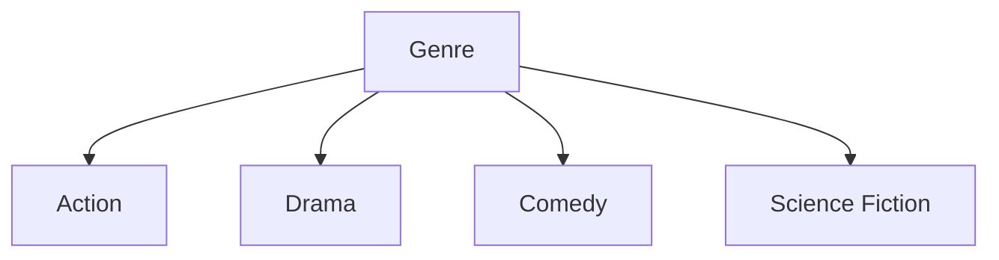
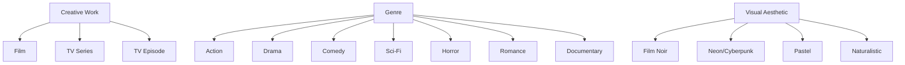
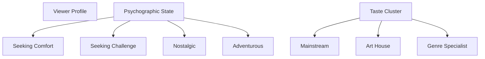
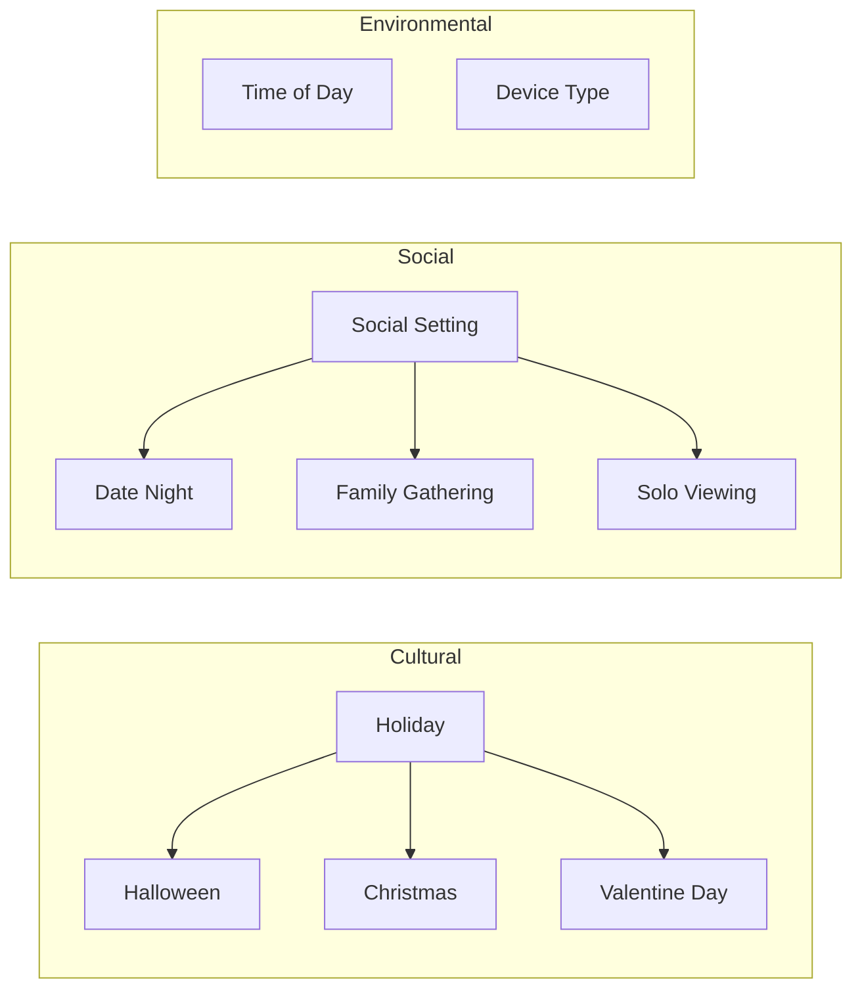
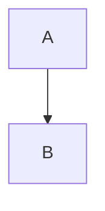

# GMC-O Ontology Visualization Guide

## Overview

The Global Media & Context Ontology (GMC-O) visualization pipeline automatically generates multiple visual representations to help understand the ontology structure. This guide is designed for frontend developers who need to work with the ontology but aren't ontology experts.

## Quick Start

### Generate All Visualizations

```bash
cd /home/devuser/workspace/hackathon-tv5
python3 scripts/visualize_ontology.py --format all
```

### View Interactive Explorer

Open the HTML viewer in your browser:

```bash
# The file is at:
design/ontology/visualizations/index.html
```

This provides an interactive web interface to explore all classes, properties, and namespaces.

## Understanding the Ontology Structure

### What is GMC-O?

GMC-O is a knowledge representation system that defines:
- **Media content** (films, series, genres, visual styles)
- **User preferences** (psychographic states, taste clusters)
- **Context** (holidays, social settings, device types)
- **GPU processing** (semantic analysis, vector search)

### Core Concepts for Developers

#### 1. **Classes** = Content Types
Think of classes as TypeScript interfaces. Each class defines a type of entity:

```typescript
// This ontology class...
media:Film a owl:Class

// ...is like this TypeScript interface
interface Film extends CreativeWork {
  hasGenre: Genre;
  hasVisualAesthetic: VisualAesthetic;
  hasPacing: Pacing;
}
```

#### 2. **Properties** = Relationships & Attributes
Properties connect entities together:

```typescript
// Object Properties (relationships between entities)
sem:hasGenre: Film -> Genre
user:hasCurrentState: ViewerProfile -> PsychographicState

// Data Properties (attributes with values)
media:duration: number  // minutes
user:completionPercentage: float  // 0.0-1.0
```

#### 3. **Namespaces** = Domain Modules
The ontology is organized into color-coded modules:

| Namespace | Color | Purpose | Example Classes |
|-----------|-------|---------|----------------|
| `media:` | 🔴 Red | Content & metadata | Film, Genre, NarrativeStructure |
| `user:` | 🩵 Teal | User profiles | ViewerProfile, TasteCluster, ToleranceLevel |
| `ctx:` | 🔵 Blue | Contextual factors | Holiday, SocialSetting, TimeOfDay |
| `gpu:` | 🟠 Orange | GPU processing | SemanticForceComputation, VectorSimilaritySearch |

## Available Visualizations

### 1. Interactive HTML Viewer (Recommended)

**File**: `design/ontology/visualizations/index.html`

**Features**:
- Browse classes by namespace
- View all properties and their types
- See parent-child relationships
- Filter and search
- No installation required

**Use Case**: Quick exploration, onboarding new developers

### 2. GraphViz Diagrams (.dot files)

**Files**:
- `full-hierarchy.dot` - Complete class hierarchy
- `media-namespace.dot` - Media domain only
- `user-namespace.dot` - User domain only
- `ctx-namespace.dot` - Context domain only
- `gpu-namespace.dot` - GPU processing domain only

**Generate PNG/SVG**:
```bash
# Install GraphViz first (if not available)
sudo apt-get install graphviz  # Linux
# brew install graphviz         # macOS

# Generate images
cd design/ontology/visualizations
dot -Tpng full-hierarchy.dot -o full-hierarchy.png
dot -Tsvg full-hierarchy.dot -o full-hierarchy.svg

# Generate namespace-specific images
for ns in media user ctx gpu; do
  dot -Tpng ${ns}-namespace.dot -o ${ns}-namespace.png
done
```

**Use Case**: Architecture documentation, presentations

### 3. Mermaid Diagrams (.mmd files)

**Files**:
- `media-classes.mmd` - Media domain class diagram
- `user-classes.mmd` - User domain class diagram
- `ctx-classes.mmd` - Context domain class diagram
- `gpu-classes.mmd` - GPU domain class diagram
- `genre-tree.mmd` - Focused Genre hierarchy
- `context-overview.mmd` - Context factor overview

**Embedding in Documentation**:
Simply copy the `.mmd` file content into markdown:

````markdown
# Genre Hierarchy


````

**Use Case**: Inline documentation, GitHub README, technical specs

### 4. WebVOWL JSON

**File**: `design/ontology/visualizations/ontology.json`

**Format**: Standard WebVOWL JSON format

**Use Case**: Integration with WebVOWL visualization tools, programmatic analysis

## Key Class Hierarchies

### Media Domain



### User Domain



### Context Domain



## Common Use Cases

### 1. Adding New Content Types

**Example**: Add a new visual aesthetic

```turtle
media:VintageAesthetic a owl:Class ;
    rdfs:label "Vintage Aesthetic"@en ;
    rdfs:subClassOf media:VisualAesthetic ;
    rdfs:comment "Sepia tones, grain, period-appropriate color grading"@en .
```

**Then regenerate visualizations**:
```bash
python3 scripts/visualize_ontology.py --format all
```

### 2. Understanding Relationships

**Find what properties connect to a class**:

1. Open `index.html`
2. Click "Properties" tab
3. Filter by domain/range

**Or check the JSON**:
```bash
cat design/ontology/visualizations/ontology.json | \
  jq '.property[] | select(.domain == "media:CreativeWork")'
```

### 3. Frontend Integration

**Example**: Fetch genre tree for dropdown

```typescript
// Load the ontology JSON
import ontology from './ontology.json';

// Extract genre hierarchy
const genres = ontology.class
  .filter(cls => cls.iri.startsWith('media:') &&
                 cls.subClassOf === 'media:Genre')
  .map(cls => ({
    id: cls.iri,
    label: cls.label,
    description: cls.comment
  }));

// Use in React component
<GenreFilter genres={genres} />
```

## Automated Updates

### Git Hook (Recommended)

Create `.git/hooks/pre-commit`:

```bash
#!/bin/bash
# Regenerate visualizations if ontology changes

if git diff --cached --name-only | grep -q "expanded-media-ontology.ttl"; then
  echo "Ontology changed, regenerating visualizations..."
  python3 scripts/visualize_ontology.py --format all
  git add design/ontology/visualizations/
fi
```

Make it executable:
```bash
chmod +x .git/hooks/pre-commit
```

### CI/CD Integration

Add to GitHub Actions workflow:

```yaml
- name: Generate Ontology Visualizations
  run: |
    python3 scripts/visualize_ontology.py --format all

- name: Upload Visualizations
  uses: actions/upload-artifact@v3
  with:
    name: ontology-visualizations
    path: design/ontology/visualizations/
```

## Troubleshooting

### GraphViz Not Installed

**Error**: `dot: command not found`

**Solution**:
```bash
# Ubuntu/Debian
sudo apt-get install graphviz

# macOS
brew install graphviz

# Then regenerate
cd design/ontology/visualizations
dot -Tpng full-hierarchy.dot -o full-hierarchy.png
```

### HTML Viewer Shows Empty Data

**Possible causes**:
1. Ontology parsing failed (check for syntax errors in `.ttl`)
2. JSON wasn't generated (check `ontology.json` exists)

**Debug**:
```bash
python3 scripts/visualize_ontology.py --format webvowl
cat design/ontology/visualizations/ontology.json | jq '.class | length'
```

### Mermaid Diagrams Not Rendering

**In GitHub**: Ensure you're using triple backticks with `mermaid` language identifier:

````markdown

````

**In documentation tools**: Check your tool supports Mermaid (most modern tools do)

## Command Reference

### Generate All Formats
```bash
python3 scripts/visualize_ontology.py --format all
```

### Generate Specific Format
```bash
python3 scripts/visualize_ontology.py --format graphviz
python3 scripts/visualize_ontology.py --format mermaid
python3 scripts/visualize_ontology.py --format webvowl
python3 scripts/visualize_ontology.py --format html
```

### Custom Input/Output
```bash
python3 scripts/visualize_ontology.py \
  --ttl path/to/ontology.ttl \
  --output-dir path/to/output
```

### Get Help
```bash
python3 scripts/visualize_ontology.py --help
```

## Best Practices

### For Documentation
1. Use **Mermaid diagrams** in markdown for inline docs
2. Use **PNG exports** for presentations and architecture diagrams
3. Link to **HTML viewer** for comprehensive exploration

### For Development
1. Keep visualizations **in version control** (they're small)
2. Regenerate after **every ontology change**
3. Use **namespace views** to focus on specific domains
4. Review **disjoint relationships** to understand constraints

### For Collaboration
1. Start newcomers with the **HTML viewer**
2. Use **color coding** consistently in discussions (red=media, teal=user, etc.)
3. Reference **specific class URIs** (e.g., `media:Film`) in code reviews
4. Include **visual diagrams** in architecture decision records (ADRs)

## Advanced Usage

### Custom Visualizations

Extend `scripts/visualize_ontology.py`:

```python
from visualize_ontology import OntologyParser

# Load ontology
parser = OntologyParser(Path('expanded-media-ontology.ttl'))

# Custom analysis
media_classes = [c for c in parser.classes.values()
                 if c.namespace == 'media']

# Generate custom diagram
# ... your logic here
```

### Querying the Ontology

Use the WebVOWL JSON for programmatic queries:

```python
import json

# Load ontology
with open('visualizations/ontology.json') as f:
    onto = json.load(f)

# Find all properties with range Genre
genre_props = [p for p in onto['property']
               if 'Genre' in p.get('range', '')]
```

## Resources

- **Ontology Source**: `design/ontology/expanded-media-ontology.ttl`
- **Visualization Script**: `scripts/visualize_ontology.py`
- **Output Directory**: `design/ontology/visualizations/`
- **Interactive Viewer**: `design/ontology/visualizations/index.html`

## Support

For questions or issues:
1. Check the interactive HTML viewer first
2. Review this guide
3. Examine the generated `.dot` or `.mmd` files
4. Open an issue with the ontology development team

---

**Version**: 2.0
**Last Updated**: 2025-12-04
**Maintainer**: TV5 Monde Media Gateway Team
