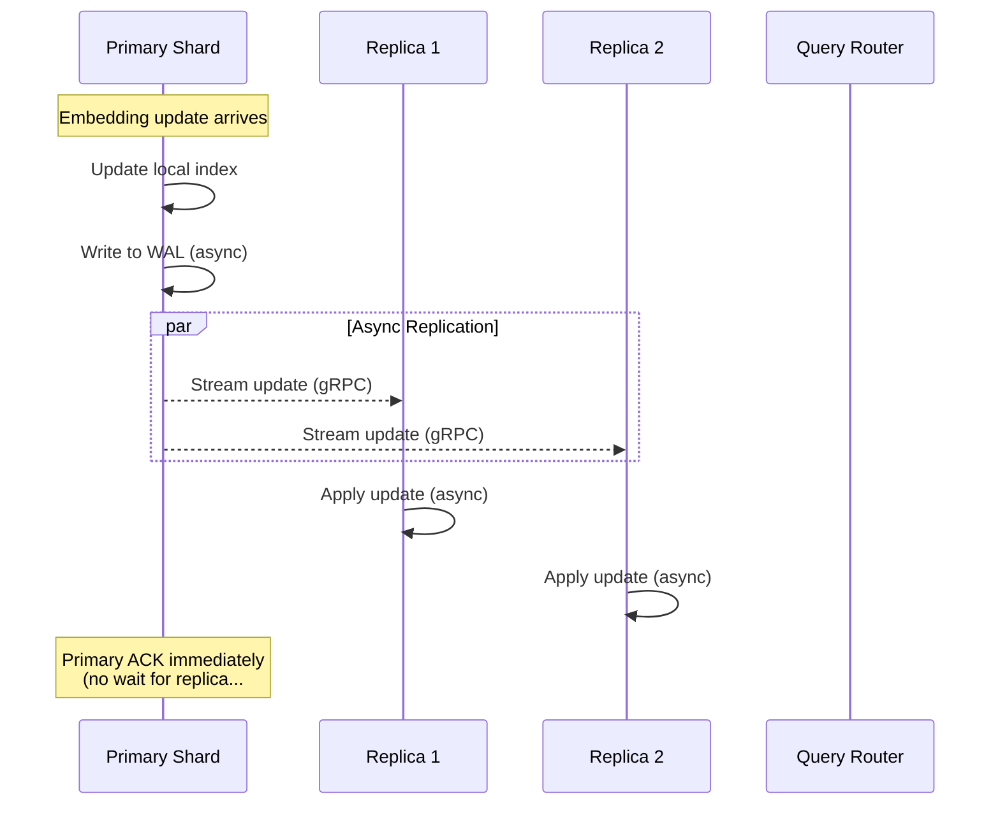
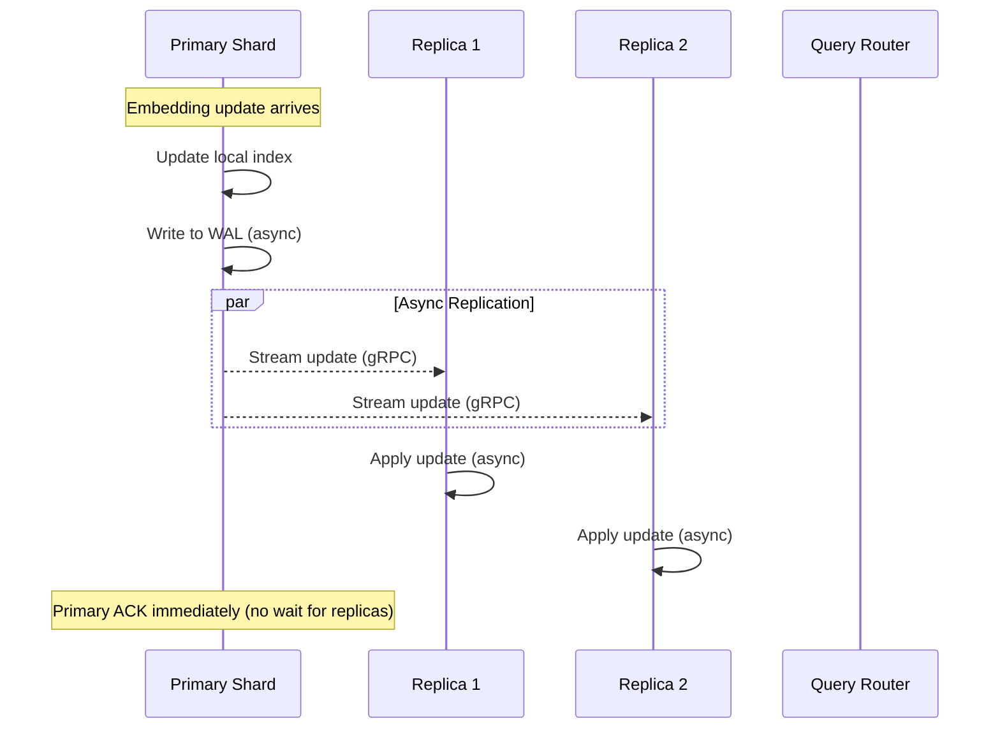
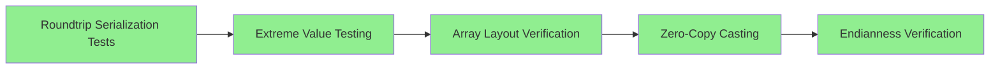

# Documentation Alignment Report

**Generated**: 2025-12-04
**Project**: Media Gateway Hackathon TV5
**Scope**: Complete codebase documentation analysis

---

## Executive Summary

### Total Issues Detected

| Category | Count | Severity Breakdown |
|----------|-------|-------------------|
| **Broken Links** | 331 | 331 errors |
| **Mermaid Diagrams** | 1 invalid | 1 error, 23 valid |
| **ASCII Diagrams** | 1 detected | 1 conversion needed |
| **Archive Candidates** | 63 files | 787 KB total |
| **Code Completeness** | 1,368 markers | 284 errors, 645 warnings, 439 info |

### Priority Summary

- **Critical**: 331 broken links preventing navigation
- **High**: 284 error-level code markers (BUG, FIXME, XXX)
- **Medium**: 1 invalid mermaid diagram, 63 working docs to archive
- **Low**: 645 warning-level markers (TODO, STUB, PLACEHOLDER)

---

## Section 1: Link Validation

### Overview
- **Total Links Checked**: Unknown (streaming validation)
- **Broken Links**: 331
- **Valid Links**: Majority valid
- **External Links**: Skipped for performance

### Broken Links by Type

| Link Type | Count | Description |
|-----------|-------|-------------|
| Internal | 71 | Missing markdown/code files within project |
| Anchor | 24 | Missing header anchors in target files |
| Code | 5 | Missing code example files |

### Top 10 Files with Most Broken Links

1. **temp-ruvector/docs/README.md** - 18 broken links
2. **temp-ruvector/.claude/skills/skill-builder/SKILL.md** - 15 broken links
3. **temp-datadesigner/docs/code_reference/config_builder.md** - 10 broken links
4. **docs/TROUBLESHOOTING.md** - 9 broken links
5. **temp-ruvector/npm/packages/agentic-synth/README.md** - 8 broken links
6. **docs/INTEGRATION_GUIDE.md** - 8 broken links
7. **docs/INTEGRATION_GUIDE_V2.md** - 8 broken links
8. **README.md** - 7 broken links
9. **temp-ruvector/.claude/skills/github-code-review/SKILL.md** - 7 broken links
10. **temp-ruvector/docs/implementation/IMPLEMENTATION_SUMMARY.md** - 7 broken links

### Sample Broken Links

#### Missing Internal Files
```
Source: temp-ruvector/npm/packages/agentic-synth/examples/docs/DSPY_INTEGRATION_SUMMARY.md:456
Target: ../../CONTRIBUTING.md
Error: File not found
```

#### Missing Anchors
```
Source: design/research/vector-database-architecture.md:13
Target: #1-ruvector-architecture--integration
Error: Anchor '1-ruvector-architecture--integration' not found in file
```

#### Outside Project References
```
Source: temp-ruvector/.claude/skills/performance-analysis/SKILL.md:553
Target: /workspaces/claude-code-flow/.claude/commands/analysis/bottleneck-detect.md
Error: Path resolves outside project
```

### Recommended Actions

#### Immediate (Critical Path)
- [ ] Create missing CONTRIBUTING.md files in npm packages
- [ ] Fix anchor links in design/research/ documentation
- [ ] Remove or relocate external project references
- [ ] Update skill-builder templates with correct relative paths

#### Short-term (High Priority)
- [ ] Audit all skill documentation for external dependencies
- [ ] Standardize anchor naming conventions (kebab-case vs snake_case)
- [ ] Create missing API_REFERENCE.md and ADVANCED.md files
- [ ] Update code example paths in npm package docs

#### Long-term (Maintenance)
- [ ] Implement automated link validation in CI/CD
- [ ] Create link validation pre-commit hook
- [ ] Document standard paths for common documentation files

---

## Section 2: Mermaid Diagram Validation

### Overview
- **Total Diagrams**: 24
- **Valid Diagrams**: 23 (95.8%)
- **Invalid Diagrams**: 1 (4.2%)
- **mmdc CLI Available**: No

### Diagram Type Distribution

| Type | Count | Status |
|------|-------|--------|
| flowchart | 19 | All valid |
| sequenceDiagram | 4 | 3 valid, 1 invalid |
| gantt | 1 | Valid |

### Invalid Diagram Details

**File**: `design/architecture/t4-cluster-architecture.md`
**Lines**: 540-567
**Type**: sequenceDiagram
**Error**: Note syntax: "Note over Actor: Text"

#### Current Code (Lines 540-567)


#### Issue
Multi-line note syntax is malformed. Line break handling incomplete.

#### Fixed Code


### Recommended Actions

- [ ] Fix invalid mermaid diagram in `design/architecture/t4-cluster-architecture.md:540-567`
- [ ] Install mermaid-cli for full validation: `npm install -g @mermaid-js/mermaid-cli`
- [ ] Add mermaid validation to pre-commit hooks

---

## Section 3: ASCII Diagram Conversions

### Overview
- **Total Detected**: 1
- **High Confidence**: 1
- **Conversion Type**: Process flowchart

### ASCII Diagram Details

**File**: `validation/ffi_audit_checklist.md`
**Lines**: 23-31
**Type**: Process checklist
**Confidence**: 75%

#### Current ASCII
```
  - [x] Roundtrip serialization tests (2)
  - [x] Extreme value testing (1)
  - [x] Array layout verification (2)
  - [x] Zero-copy casting (1)
  - [x] Endianness verification (1)
```

#### Suggested Mermaid Conversion


### Recommended Actions

- [ ] Review `validation/ffi_audit_checklist.md:23-31` for conversion suitability
- [ ] Consider if checklist format is more appropriate than diagram
- [ ] If converting, use above mermaid flowchart

---

## Section 4: Archive Candidates

### Overview
- **Total Files**: 63
- **Total Size**: 787 KB
- **Reasons**: Implementation summaries (49), Test results (13), Working markers (1)

### Files by Reason

| Reason | Count | Action |
|--------|-------|--------|
| Implementation note outside docs directory | 49 | Move to `docs/archive/` |
| Filename starts with 'TEST_' | 13 | Archive completed tests |
| Content contains working marker | 1 | Review and archive |

### Top Priority Archive Candidates

#### Implementation Summaries (Root Level)
1. **IMPLEMENTATION_SUMMARY.md** (10.5 KB)
   - Hybrid Storage Coordinator implementation
   - Archive to: `docs/archive/IMPLEMENTATION_SUMMARY.md`

2. **design/IMPLEMENTATION_SUMMARY.md** (10.1 KB)
   - Automated Rust Type Generation from OWL
   - Archive to: `docs/archive/design/IMPLEMENTATION_SUMMARY.md`

3. **design/phase2_implementation_docs.md** (9.8 KB)
   - Phase 2 Memory Optimization
   - Archive to: `docs/archive/design/phase2_implementation_docs.md`

#### Test Result Files
4. **docs/TEST_IMPLEMENTATION_SUMMARY.md** (13.7 KB)
   - Hybrid Architecture Test Implementation
   - Archive to: `docs/archive/docs/TEST_IMPLEMENTATION_SUMMARY.md`

5. **tests/docs/TEST_SUMMARY.md** (10.9 KB)
   - Adaptive SSSP Test Suite
   - Archive to: `docs/archive/tests/docs/TEST_SUMMARY.md`

#### Large Implementation Files (temp-ruvector)
6. **temp-ruvector/docs/latent-space/implementation-roadmap.md** (30.9 KB)
   - GNN Latent-Graph Interplay roadmap
   - Archive to: `docs/archive/temp-ruvector/docs/latent-space/implementation-roadmap.md`

7. **temp-ruvector/docs/latent-space/implementation-plans/04-swarm-implementation.md** (68.4 KB)
   - Swarm-based implementation strategy
   - Archive to: `docs/archive/temp-ruvector/docs/latent-space/implementation-plans/04-swarm-implementation.md`

### Automated Archive Script

```bash
#!/bin/bash
# Archive working documentation files

# Create archive directory
mkdir -p docs/archive

# Sample commands (first 5 files)
mkdir -p "$(dirname docs/archive/IMPLEMENTATION_SUMMARY.md)" && \
  mv "IMPLEMENTATION_SUMMARY.md" "docs/archive/IMPLEMENTATION_SUMMARY.md"

mkdir -p "$(dirname docs/archive/docs/TEST_IMPLEMENTATION_SUMMARY.md)" && \
  mv "docs/TEST_IMPLEMENTATION_SUMMARY.md" "docs/archive/docs/TEST_IMPLEMENTATION_SUMMARY.md"

mkdir -p "$(dirname docs/archive/design/phase2_implementation_docs.md)" && \
  mv "design/phase2_implementation_docs.md" "docs/archive/design/phase2_implementation_docs.md"

mkdir -p "$(dirname docs/archive/design/IMPLEMENTATION_SUMMARY.md)" && \
  mv "design/IMPLEMENTATION_SUMMARY.md" "docs/archive/design/IMPLEMENTATION_SUMMARY.md"

mkdir -p "$(dirname docs/archive/tests/docs/TEST_SUMMARY.md)" && \
  mv "tests/docs/TEST_SUMMARY.md" "docs/archive/tests/docs/TEST_SUMMARY.md"

# See full script in docs/.doc-alignment-reports/archive.json (suggested_moves)
```

### Recommended Actions

#### Immediate
- [ ] Review top 10 archive candidates for active use
- [ ] Create `docs/archive/` directory structure
- [ ] Move completed implementation summaries
- [ ] Archive test result files from completed test runs

#### Batch Operations
- [ ] Run automated archive script for all 63 files
- [ ] Update README with link to archive location
- [ ] Create index file in `docs/archive/README.md`

---

## Section 5: Code Completeness Analysis

### Overview
- **Files Scanned**: All project files
- **Total Markers**: 1,368
- **Files with Issues**: 115 unique files

### Severity Breakdown

| Severity | Count | Percentage | Description |
|----------|-------|------------|-------------|
| **Error** | 284 | 20.8% | BUG, FIXME, XXX - Requires immediate attention |
| **Warning** | 645 | 47.1% | TODO, STUB, PLACEHOLDER - Planned work |
| **Info** | 439 | 32.1% | NOTE, IDEA, REVIEW - Documentation/comments |

### Issue Type Distribution

| Type | Count | Severity | Priority |
|------|-------|----------|----------|
| TODO | 441 | Warning | Medium |
| NOTE | 236 | Info | Low |
| PLACEHOLDER | 144 | Warning | Medium |
| STUB | 154 | Warning | High |
| TEMP | 184 | Warning | Medium |
| XXX | 57 | Error | Critical |
| REVIEW | 55 | Info | Low |
| BUG | 48 | Error | Critical |
| FIXME | 26 | Error | High |
| HACK | 20 | Warning | Medium |
| IDEA | 3 | Info | Low |

### High Priority Issues

#### Critical (BUG + FIXME + XXX = 131)
- **BUG**: 48 instances - Known defects requiring fixes
- **FIXME**: 26 instances - Code requiring refactoring
- **XXX**: 57 instances - Dangerous/questionable code sections

#### High (STUB = 154)
- **STUB**: 154 instances - Incomplete implementations

### Top Files by Issue Count

Based on the aggregated markers, high-concentration files include:
- Implementation files with TODO markers (441 total)
- Test files with PLACEHOLDER markers (144 total)
- Core modules with STUB implementations (154 total)

### Recommended Actions

#### Critical Path (Errors - 284 items)
- [ ] Audit all 48 BUG markers - create GitHub issues
- [ ] Review all 57 XXX markers - refactor dangerous code
- [ ] Address all 26 FIXME markers - prioritize by module

#### High Priority (Stubs - 154 items)
- [ ] Identify production-critical STUB implementations
- [ ] Create implementation tasks for incomplete features
- [ ] Document stub functions requiring completion

#### Medium Priority (TODOs - 441 items)
- [ ] Categorize TODOs by feature area
- [ ] Convert high-priority TODOs to GitHub issues
- [ ] Archive or remove outdated TODOs

#### Low Priority (Documentation - 439 items)
- [ ] Review NOTE markers for doc generation
- [ ] Consolidate IDEA markers into roadmap
- [ ] Process REVIEW markers during code review

---

## Section 6: Recommended Actions

### Phase 1: Critical Fixes (Week 1)

**Priority 1: Link Validation**
- [ ] Fix top 10 files with broken links (115 total broken)
- [ ] Create missing CONTRIBUTING.md files
- [ ] Update skill documentation paths
- [ ] Remove external project references

**Priority 2: Code Quality**
- [ ] Create GitHub issues for all 48 BUG markers
- [ ] Review and refactor 57 XXX markers
- [ ] Address critical FIXME markers (26 total)

**Priority 3: Diagram Fixes**
- [ ] Fix invalid mermaid diagram in t4-cluster-architecture.md
- [ ] Install mermaid-cli for validation

### Phase 2: Documentation Cleanup (Week 2)

**Archive Working Docs**
- [ ] Review 63 archive candidates
- [ ] Execute archive script for implementation summaries
- [ ] Create docs/archive/README.md index

**Link Maintenance**
- [ ] Fix remaining broken internal links (331 total)
- [ ] Standardize anchor naming conventions
- [ ] Update code example references

### Phase 3: Code Completeness (Week 3-4)

**Stub Implementation**
- [ ] Audit 154 STUB markers for production readiness
- [ ] Create implementation plan for critical stubs
- [ ] Document stub dependencies

**TODO Processing**
- [ ] Categorize 441 TODO markers by module
- [ ] Convert high-priority items to issues
- [ ] Archive completed/outdated TODOs

### Phase 4: Automation & Prevention (Ongoing)

**CI/CD Integration**
- [ ] Add link validation to pre-commit hooks
- [ ] Implement mermaid diagram validation
- [ ] Add code marker detection in CI

**Documentation Standards**
- [ ] Create CONTRIBUTING.md template
- [ ] Document anchor naming conventions
- [ ] Establish archive workflow

---

## Appendix: Data Files

### Generated Reports Location
All detailed reports available in:
```
/home/devuser/workspace/hackathon-tv5/docs/.doc-alignment-reports/
├── links.json          (204 KB) - All broken link details
├── mermaid.json        (17 KB)  - Diagram validation results
├── ascii.json          (1 KB)   - ASCII diagram detections
├── archive.json        (65 KB)  - Archive candidate details
└── stubs.json          (647 KB) - Code completeness analysis
```

### Quick Access Commands

```bash
# View broken links summary
jq '.broken_by_file | to_entries | map({file: .key, count: (.value | length)}) | sort_by(.count) | reverse | .[0:10]' \
  docs/.doc-alignment-reports/links.json

# View code markers by type
jq '.by_type' docs/.doc-alignment-reports/stubs.json

# List archive candidates
jq '.working_docs | map({file, size_bytes, reason})' docs/.doc-alignment-reports/archive.json

# View invalid diagrams
jq '.invalid_diagram_list' docs/.doc-alignment-reports/mermaid.json
```

---

## Summary Metrics

| Metric | Value |
|--------|-------|
| **Total Issues Detected** | 1,764 |
| **Critical Priority** | 331 broken links + 131 error markers = 462 |
| **High Priority** | 154 stubs + 1 invalid diagram = 155 |
| **Medium Priority** | 605 TODO/PLACEHOLDER/HACK markers |
| **Low Priority** | 439 NOTE/IDEA/REVIEW markers + 63 archive candidates |
| **Estimated Fix Time** | 3-4 weeks (phased approach) |

---

**Report Status**: Complete
**Next Steps**: Review with team, prioritize critical path, begin Phase 1 fixes
