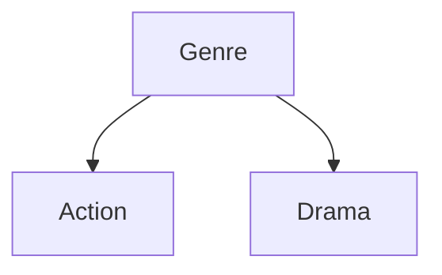

# GMC-O Ontology Visualizations

This directory contains automatically generated visual representations of the Global Media & Context Ontology (GMC-O).

## 📁 Contents

### Interactive Viewers
- **`index.html`** - Interactive web-based ontology explorer (open in browser)

### Data Files
- **`ontology.json`** - WebVOWL-compatible JSON representation

### GraphViz Diagrams (.dot)
- `full-hierarchy.dot` - Complete class hierarchy with all relationships
- `media-namespace.dot` - Media & Content domain focused view
- `user-namespace.dot` - User & Psychographics domain focused view
- `ctx-namespace.dot` - Context domain focused view
- `gpu-namespace.dot` - GPU Processing domain focused view

### Mermaid Diagrams (.mmd)
- `media-classes.mmd` - Media domain class diagram
- `user-classes.mmd` - User domain class diagram
- `ctx-classes.mmd` - Context domain class diagram
- `gpu-classes.mmd` - GPU domain class diagram
- `genre-tree.mmd` - Focused Genre hierarchy
- `context-overview.mmd` - Context factor overview

### Generated Images (if GraphViz installed)
- `*.png` - PNG raster images
- `*.svg` - SVG vector graphics

## 🚀 Quick Start

### View Interactive Explorer
```bash
# Open in your browser
open index.html
```

### Generate PNG/SVG Images
```bash
# Requires GraphViz installation
cd ../../../scripts
./generate_images.sh
```

### Regenerate All Visualizations
```bash
cd ../../../
python3 scripts/visualize_ontology.py --format all
```

## 📊 Visualization Types

### 1. Interactive HTML Viewer (Recommended for Exploration)
**Best for**: Browsing, learning, onboarding new team members

Open `index.html` to:
- Browse all classes by namespace
- View properties and relationships
- Search and filter
- See detailed descriptions

### 2. GraphViz Diagrams (Best for Documentation)
**Best for**: Architecture diagrams, presentations, printed docs

Generate images:
```bash
dot -Tpng full-hierarchy.dot -o full-hierarchy.png
dot -Tsvg media-namespace.dot -o media-namespace.svg
```

### 3. Mermaid Diagrams (Best for Inline Documentation)
**Best for**: GitHub README, markdown docs, technical specs

Embed in markdown:
````markdown

````

## 🎨 Color Coding

The visualizations use consistent color coding:

| Color | Namespace | Domain |
|-------|-----------|--------|
| 🔴 Red (`#FF6B6B`) | `media:` | Media & Content |
| 🩵 Teal (`#4ECDC4`) | `user:` | User & Psychographics |
| 🔵 Blue (`#45B7D1`) | `ctx:` | Context |
| 🟠 Orange (`#FFA07A`) | `gpu:` | GPU Processing |

## 🔄 Automatic Regeneration

Visualizations are automatically regenerated when the ontology changes:

1. **Git Hook**: Pre-commit hook regenerates on ontology changes
2. **Manual**: Run `python3 scripts/visualize_ontology.py --format all`

## 📖 Full Documentation

See `../VISUALIZATION.md` for comprehensive documentation including:
- Detailed usage guide
- Integration examples
- Troubleshooting
- Best practices

## 🔧 Dependencies

### Required (Python)
- Python 3.7+
- No external Python packages (uses standard library only)

### Optional (Image Generation)
- GraphViz (`dot` command)
  - Ubuntu/Debian: `sudo apt-get install graphviz`
  - macOS: `brew install graphviz`
  - Alpine: `apk add graphviz`

## 📊 Statistics

This ontology contains:
- **80 classes** across 4 main namespaces
- **21 properties** (object, datatype, and functional)
- **Multiple inheritance hierarchies** for different domains

## 🛠️ Customization

To generate custom visualizations, modify or extend:
- `../../../scripts/visualize_ontology.py`

See the script's docstrings for extension points.

---

**Auto-generated from**: `../expanded-media-ontology.ttl`
**Generator**: `scripts/visualize_ontology.py`
**Last Updated**: 2025-12-04
