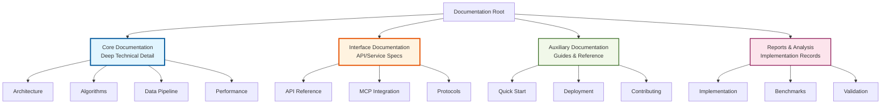
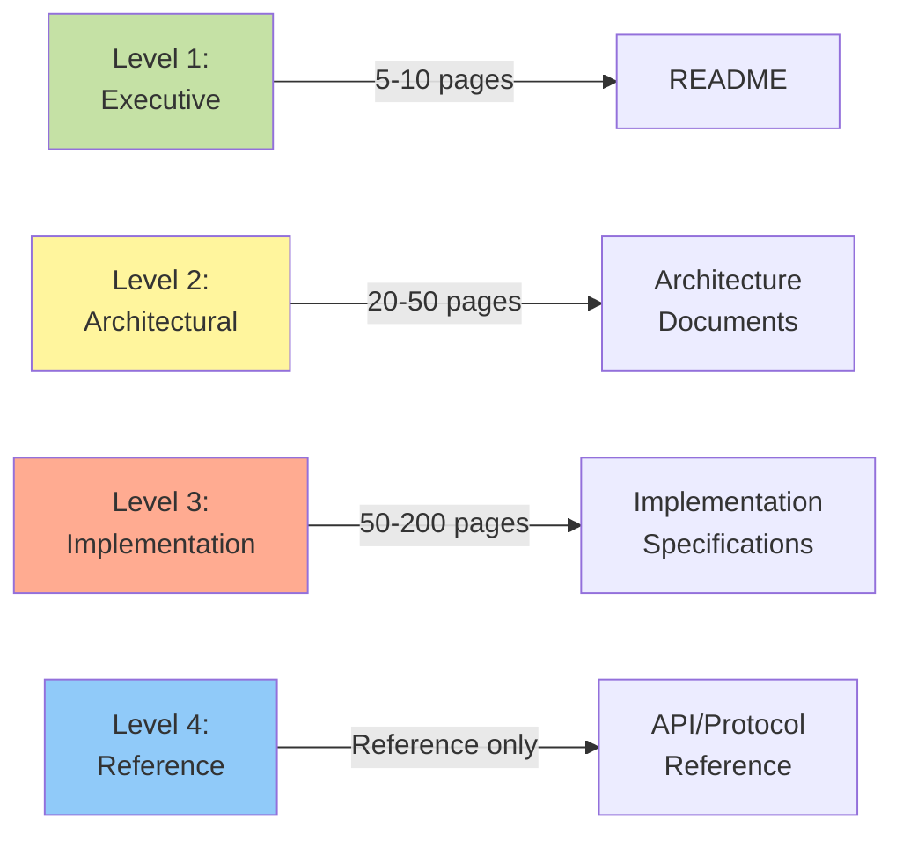
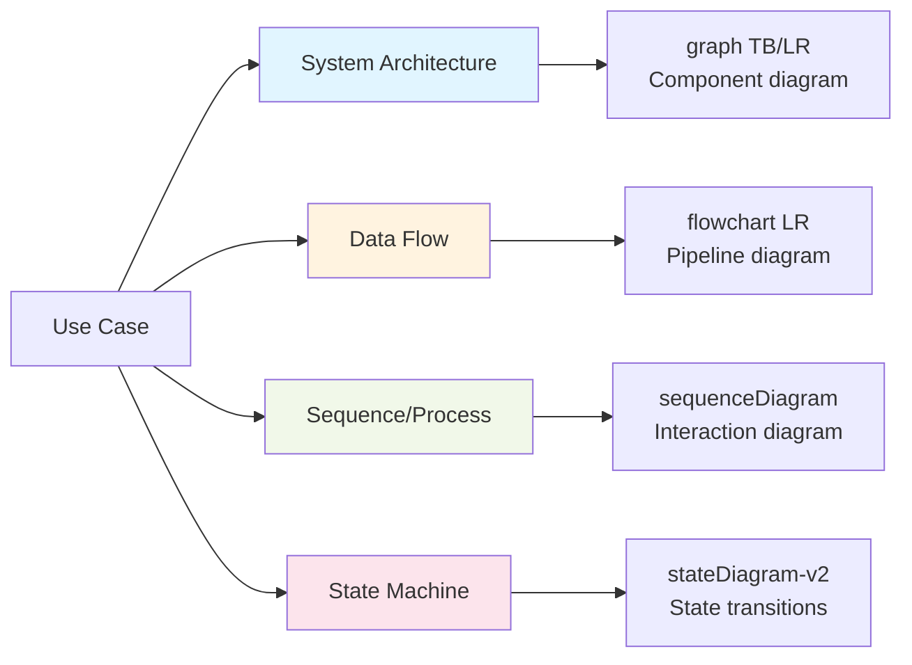
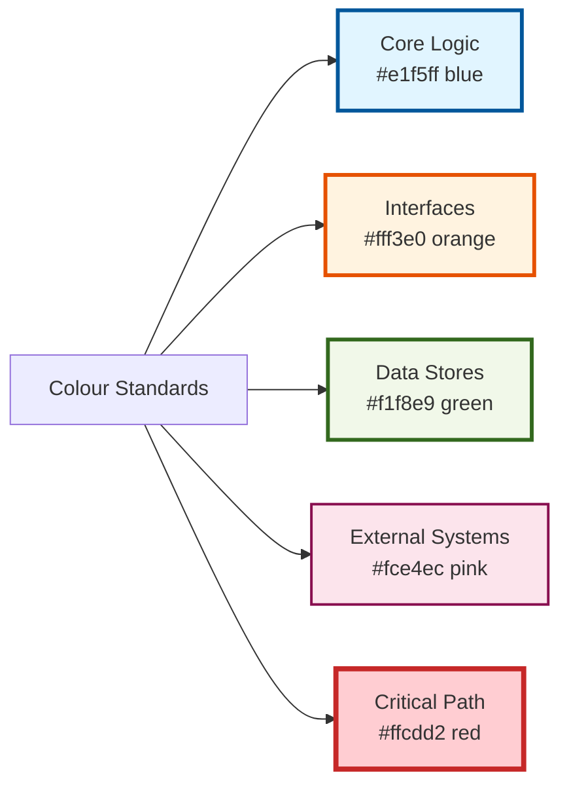
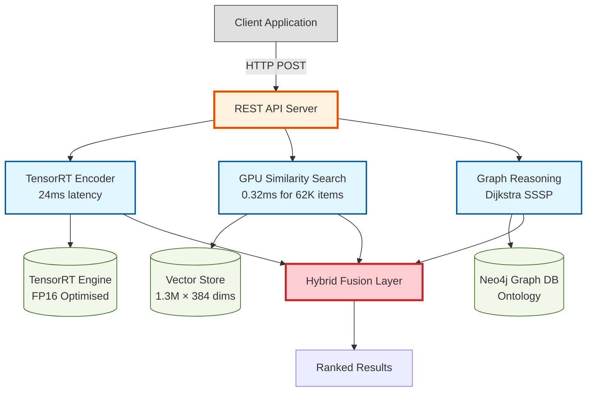
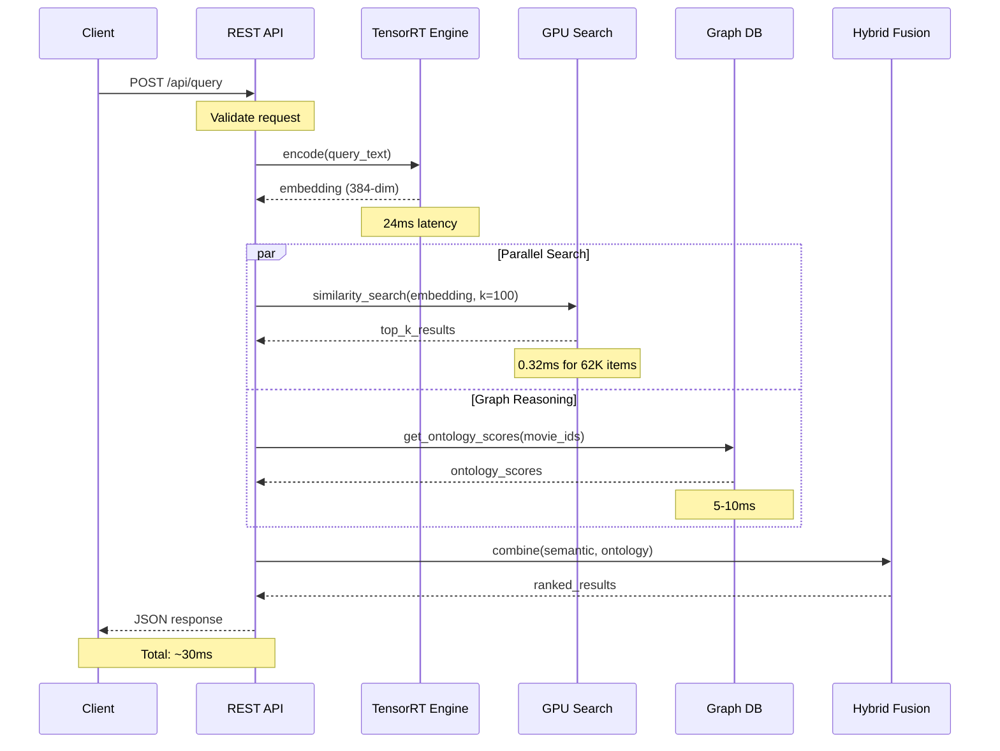
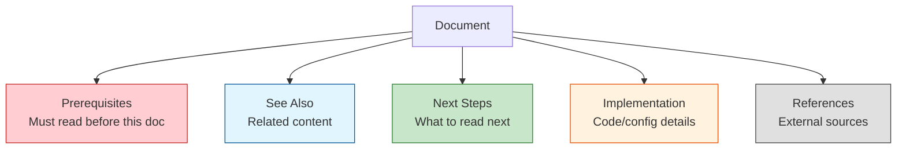
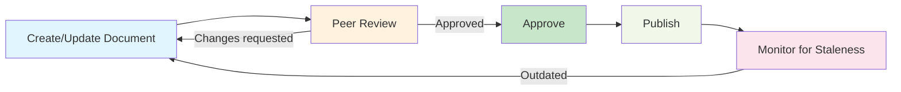

# Documentation Architecture

**Version:** 2.0
**Date:** 2025-12-07
**Status:** Production-Ready
**Audience:** Technical writers, system architects, developers

---

## Executive Summary

This document defines the production-grade documentation architecture for the semantic recommender system. It establishes a hierarchical structure prioritising **core logic depth**, **interface precision**, and **minimal auxiliary overhead**, conforming to UK English technical writing standards with comprehensive Mermaid visualisations.

**Design Philosophy:**
1. **Hierarchical navigation** - Clear information architecture
2. **Mermaid-first visualisation** - All architecture/flow diagrams as code
3. **UK English** - Consistent British spelling and grammar
4. **Technical rigour** - Deep algorithmic detail where it matters
5. **Interface precision** - Comprehensive API/service documentation
6. **Concise auxiliary** - Streamlined guides for non-critical paths

---

## Table of Contents

1. [Documentation Hierarchy](#documentation-hierarchy)
2. [Directory Structure](#directory-structure)
3. [Document Categories](#document-categories)
4. [Style Guide](#style-guide)
5. [Diagram Standards](#diagram-standards)
6. [Templates](#templates)
7. [Cross-Reference Strategy](#cross-reference-strategy)
8. [Version Control](#version-control)
9. [Maintenance Protocol](#maintenance-protocol)

---

## Documentation Hierarchy



### Documentation Levels



---

## Directory Structure

```mermaid
graph TB
    DOCS[docs/]

    DOCS --> ARCH[architecture/]
    DOCS --> ALGO[algorithms/]
    DOCS --> API[api/]
    DOCS --> GUIDES[guides/]
    DOCS --> REPORTS[reports/]
    DOCS --> REF[reference/]

    ARCH --> ARCH_SYS[SYSTEM_OVERVIEW.md<br/>Top-level architecture]
    ARCH --> ARCH_COMP[COMPONENT_DESIGN.md<br/>Component interactions]
    ARCH --> ARCH_DATA[DATA_ARCHITECTURE.md<br/>Data flow & storage]
    ARCH --> ARCH_DEPLOY[DEPLOYMENT_ARCHITECTURE.md<br/>Infrastructure design]

    ALGO --> ALGO_SSSP[SSSP_ALGORITHMS.md<br/>Dijkstra & Duan SSSP]
    ALGO --> ALGO_EMBED[EMBEDDING_PIPELINE.md<br/>TensorRT encoding]
    ALGO --> ALGO_FUSION[HYBRID_FUSION.md<br/>Neuro-symbolic fusion]
    ALGO --> ALGO_GRAPH[GRAPH_REASONING.md<br/>Ontology reasoning]

    API --> API_REST[REST_API.md<br/>HTTP endpoints]
    API --> API_MCP[MCP_SERVER.md<br/>MCP integration]
    API --> API_PROTO[PROTOCOLS.md<br/>Wire formats]

    GUIDES --> GUIDES_QUICK[QUICKSTART.md<br/>5-minute setup]
    GUIDES --> GUIDES_DEPLOY[DEPLOYMENT_GUIDE.md<br/>Production deployment]
    GUIDES --> GUIDES_PERF[PERFORMANCE_TUNING.md<br/>Optimisation]

    REPORTS --> REPORTS_IMPL[IMPLEMENTATION_REPORT.md<br/>Build records]
    REPORTS --> REPORTS_BENCH[BENCHMARK_RESULTS.md<br/>Performance data]
    REPORTS --> REPORTS_VALID[VALIDATION_REPORT.md<br/>Test results]

    REF --> REF_GLOSSARY[GLOSSARY.md<br/>Technical terms]
    REF --> REF_CONFIG[CONFIGURATION.md<br/>All settings]
    REF --> REF_TROUBLE[TROUBLESHOOTING.md<br/>Common issues]

    style ARCH fill:#e1f5ff,stroke:#01579b
    style ALGO fill:#e1f5ff,stroke:#01579b
    style API fill:#fff3e0,stroke:#e65100
    style GUIDES fill:#f1f8e9,stroke:#33691e
    style REPORTS fill:#fce4ec,stroke:#880e4f
    style REF fill:#e0e0e0,stroke:#424242
```



### Proposed File Structure

```
semantic-recommender/
├── README.md                              # L1: Executive overview (current)
├── ARCHITECTURE.md                        # L1: High-level architecture
├── CONTRIBUTING.md                        # Auxiliary: Contribution guide
│
├── docs/
│   ├── INDEX.md                           # Documentation navigation hub
│   │
│   ├── architecture/                      # L2: Architectural documentation (CORE)
│   │   ├── SYSTEM_OVERVIEW.md             # Complete system architecture
│   │   ├── COMPONENT_DESIGN.md            # Component interactions
│   │   ├── DATA_ARCHITECTURE.md           # Data flow and storage design
│   │   ├── DEPLOYMENT_ARCHITECTURE.md     # Infrastructure and scaling
│   │   ├── NEURO_SYMBOLIC_DESIGN.md       # Hybrid reasoning architecture
│   │   └── diagrams/                      # Mermaid source files
│   │       ├── system_context.mmd
│   │       ├── component_diagram.mmd
│   │       └── data_flow.mmd
│   │
│   ├── algorithms/                        # L3: Core logic (DEEP DETAIL)
│   │   ├── SSSP_ALGORITHMS.md             # Dijkstra & Duan SSSP deep dive
│   │   ├── EMBEDDING_PIPELINE.md          # TensorRT encoding pipeline
│   │   ├── HYBRID_FUSION.md               # Neuro-symbolic fusion logic
│   │   ├── GRAPH_REASONING.md             # Ontology reasoning algorithms
│   │   ├── SIMILARITY_COMPUTATION.md      # GPU similarity search
│   │   └── ADAPTIVE_SELECTION.md          # Algorithm selection logic
│   │
│   ├── api/                               # L3: Interface specs (INTERFACE)
│   │   ├── REST_API.md                    # HTTP API complete reference
│   │   ├── MCP_SERVER.md                  # MCP integration specification
│   │   ├── PROTOCOLS.md                   # Wire format specifications
│   │   ├── AUTHENTICATION.md              # Auth mechanisms
│   │   └── examples/                      # Request/response examples
│   │       ├── query_examples.json
│   │       └── batch_examples.json
│   │
│   ├── guides/                            # L2: Auxiliary guides (CONCISE)
│   │   ├── QUICKSTART.md                  # 5-minute getting started
│   │   ├── DEPLOYMENT_GUIDE.md            # Production deployment
│   │   ├── PERFORMANCE_TUNING.md          # Optimisation guide
│   │   ├── DATA_ENRICHMENT.md             # Semantic enrichment
│   │   └── GPU_SETUP.md                   # CUDA/TensorRT setup
│   │
│   ├── reports/                           # L4: Implementation records
│   │   ├── IMPLEMENTATION_REPORT.md       # Build and migration records
│   │   ├── BENCHMARK_RESULTS.md           # Performance measurements
│   │   ├── VALIDATION_REPORT.md           # Test suite results
│   │   ├── DATA_QUALITY_REPORT.md         # Dataset analysis
│   │   └── A100_DEPLOYMENT.md             # GPU deployment results
│   │
│   └── reference/                         # L4: Reference material
│       ├── GLOSSARY.md                    # Technical terminology
│       ├── CONFIGURATION.md               # All configuration options
│       ├── TROUBLESHOOTING.md             # Common issues and solutions
│       ├── DEPENDENCIES.md                # Software dependencies
│       └── CHANGELOG.md                   # Version history
│
├── scripts/
│   └── server/
│       └── docs/                          # Service-specific docs
│           ├── QUERY_INTERFACE.md         # Query service documentation
│           └── MCP_SERVER.md              # MCP server implementation
│
└── src/
    ├── rust/
    │   └── docs/                          # Rust component docs
    │       ├── GPU_ENGINE.md              # GPU acceleration
    │       └── ONTOLOGY_REASONING.md      # Graph reasoning
    └── cuda/
        └── docs/                          # CUDA kernel docs
            └── KERNEL_SPECIFICATIONS.md   # CUDA implementation
```

---

## Document Categories

### Category 1: Core Documentation (Deep Technical Detail)

**Purpose:** Comprehensive technical specifications for system architecture and core algorithms

**Scope:**
- System architecture and design decisions
- Algorithm specifications with mathematical notation
- Data pipeline implementation details
- Performance characteristics and trade-offs

**Detail Level:** L2-L3 (20-200 pages)

**Required Sections:**
1. Overview and context
2. Mathematical foundations (where applicable)
3. Architectural diagrams (Mermaid)
4. Implementation specifications
5. Performance analysis
6. Trade-offs and design decisions
7. References and citations

**Examples:**
- `algorithms/SSSP_ALGORITHMS.md` - Full Dijkstra and Duan SSSP specifications
- `algorithms/HYBRID_FUSION.md` - Neuro-symbolic fusion logic
- `architecture/DATA_ARCHITECTURE.md` - Complete data flow and storage design

---

### Category 2: Interface Documentation (API/Service Specs)

**Purpose:** Precise, complete specifications for all system interfaces

**Scope:**
- REST API endpoints with full request/response schemas
- MCP server protocol specifications
- Internal service interfaces
- Wire format definitions
- Authentication and authorisation

**Detail Level:** L3-L4 (Reference documentation)

**Required Sections:**
1. Protocol overview
2. Endpoint/method reference (all parameters documented)
3. Request/response schemas (JSON Schema preferred)
4. Error handling and status codes
5. Authentication mechanisms
6. Rate limiting and quotas
7. Code examples (curl, Python, JavaScript)
8. Performance characteristics

**Examples:**
- `api/REST_API.md` - Complete HTTP API reference
- `api/MCP_SERVER.md` - MCP integration specification
- `api/PROTOCOLS.md` - Wire format definitions

---

### Category 3: Auxiliary Documentation (Concise Guides)

**Purpose:** Streamlined guides for setup, deployment, and operations

**Scope:**
- Quick start (5-minute path to working system)
- Deployment guides (production setup)
- Performance tuning
- Troubleshooting

**Detail Level:** L2 (5-20 pages, focused and concise)

**Required Sections:**
1. Prerequisites
2. Step-by-step instructions
3. Verification steps
4. Common issues (brief)
5. Next steps

**Anti-patterns to avoid:**
- Excessive background information
- Duplicate content from core docs
- Implementation details (link to core docs instead)

**Examples:**
- `guides/QUICKSTART.md` - 5-minute setup
- `guides/DEPLOYMENT_GUIDE.md` - Production deployment steps
- `guides/PERFORMANCE_TUNING.md` - Optimisation checklist

---

### Category 4: Reports & analysis

**Purpose:** Implementation records, benchmark results, validation reports

**Scope:**
- Implementation histories
- Performance measurements
- Test results
- Data quality analysis
- Post-deployment reports

**Detail Level:** L4 (Reference, evidence-based)

**Required Sections:**
1. Executive summary
2. Methodology
3. Results (tables, charts)
4. analysis
5. Conclusions
6. Appendices (raw data)

**Examples:**
- `reports/IMPLEMENTATION_REPORT.md` - TMDB migration record
- `reports/BENCHMARK_RESULTS.md` - TensorRT performance data
- `reports/VALIDATION_REPORT.md` - Test suite results

---

## Style Guide

### UK English Standards

**Spelling:**
- Use British spellings: optimise (not optimise), colour (not colour), analyse (not analyse)
- Consistent terminology: kilometre, litre, metre, centre
- Use 's' not 'z': organisation, realisation, specialisation

**Grammar:**
- Use present tense for current state: "The system uses TensorRT" (not "will use")
- Use imperative for instructions: "Configure the database" (not "You should configure")
- Use passive voice for objectivity in analysis: "Performance was measured" (not "We measured")

**Punctuation:**
- Oxford comma: "neural, symbolic, and hybrid components"
- Single quotes for terms: 'embedding', 'ontology'
- Double quotes for direct quotations: The paper states "..."

---

### Technical Writing Standards

**Clarity:**
- One concept per paragraph
- Clear topic sentences
- Avoid ambiguity
- Define technical terms on first use

**Precision:**
- Specific measurements: "24ms" not "fast"
- Concrete examples: "1,334,069 movies" not "large dataset"
- Explicit conditions: "when graph size > 10K nodes" not "for large graphs"

**Structure:**
- Hierarchical headings (H1 → H2 → H3, maximum depth)
- Numbered lists for procedures
- Bulleted lists for features/characteristics
- Tables for comparisons

**Code Examples:**
```python
# Good: Complete, runnable, with context
import numpy as np
from tensorrt_wrapper import TRTInference

# Initialise TensorRT engine
engine = TRTInference("minilm_l12_v2_fp16.plan")

# Encode query
query = "dark psychological thriller"
embedding = engine.encode(query)  # Returns: (1, 384) ndarray

# Bad: Incomplete, unclear context
result = engine.encode(text)
```

**Technical Notation:**
- Mathematics: Use LaTeX notation in code blocks for complex formulae
- Algorithms: Pseudocode before implementation
- Performance: Include units, confidence intervals, sample sizes

```
Latency: 24.0ms ± 2.1ms (n=1000, 95% CI)
Throughput: 270 QPS (batch_size=32, GPU=RTX A6000)
```

---

### Document Structure Template

```markdown
# Document Title

**Version:** X.Y
**Date:** YYYY-MM-DD
**Status:** Draft | Review | Production
**Audience:** Developers | Operators | Architects

---

## Executive Summary

2-3 paragraph overview:
- What problem does this solve?
- What is the solution?
- Key metrics/results

---

## Table of Contents

1. [Section 1](#section-1)
2. [Section 2](#section-2)
...

---

## Section 1: Context

Background and motivation

---

## Section 2: Technical Specification

Core technical content with diagrams


---

## References

1. Source 1
2. Source 2

---

**Document Metadata**
- **Author:** [Name]
- **Last Updated:** YYYY-MM-DD
- **Review Status:** [Status]
```

---

## Diagram Standards

### Mermaid Best Practices

**1. Diagram Types by Use Case**



**2. Colour Coding Standards**



**3. Component Diagram Template**



**4. Data Flow Diagram Template**

```mermaid
flowchart LR
    INPUT[Query Text<br/>'dark thriller']

    INPUT --> TOKENIZE[Tokenisation<br/>WordPiece]
    TOKENIZE --> ENCODE[TensorRT Encode<br/>→ (1, 384) vector]

    ENCODE --> SEARCH[GPU Similarity Search]
    SEARCH --> TOP_K[Top-K Selection<br/>k=100]

    TOP_K --> RERANK[Ontology Reranking]
    RERANK --> FUSE[Hybrid Fusion]

    FUSE --> OUTPUT[Ranked Results]

    GRAPH[(Ontology Graph)] -.-> RERANK

    style INPUT fill:#e0e0e0
    style ENCODE fill:#e1f5ff,stroke:#01579b,stroke-width:2px
    style SEARCH fill:#e1f5ff,stroke:#01579b,stroke-width:2px
    style RERANK fill:#e1f5ff,stroke:#01579b,stroke-width:2px
    style FUSE fill:#ffcdd2,stroke:#c62828,stroke-width:3px
    style OUTPUT fill:#c8e6c9
    style GRAPH fill:#f1f8e9,stroke:#33691e
```

**5. Sequence Diagram Template**



**6. State Diagram Template**

```mermaid
stateDiagram-v2
    [*] --> Initialising

    Initialising --> LoadingModel: Load TensorRT engine
    LoadingModel --> LoadingData: Load embeddings
    LoadingData --> Ready: Initialisation complete

    Ready --> Processing: Query received

    Processing --> Encoding: Tokenise input
    Encoding --> Searching: TensorRT encode
    Searching --> Reasoning: GPU similarity
    Reasoning --> Fusing: Graph ontology
    Fusing --> Ready: Return results

    Processing --> Error: Invalid input
    Encoding --> Error: Encoding failure
    Searching --> Error: Search failure

    Error --> Ready: Log and recover

    Ready --> Shutdown: Stop signal
    Shutdown --> [*]
```



---

### Diagram Documentation Standards

**Every diagram must include:**

1. **Title and context** (in surrounding text)
2. **Legend** (if custom colours/symbols used)
3. **Scale indicators** (for performance/size metrics)
4. **Source reference** (if diagram represents implementation)

**Diagram placement:**
- Place diagrams immediately after introducing concept
- Reference diagrams in text: "See Figure 1: System Architecture"
- Use descriptive alt-text for accessibility

**File organisation:**
- Store reusable diagrams in `docs/architecture/diagrams/`
- Use `.mmd` extension for source files
- Include both source and rendered versions in documentation

---

## Templates

### 1. Architecture Document Template

```markdown
# Architecture: [Component Name]

**Version:** 1.0
**Date:** YYYY-MM-DD
**Status:** Production
**Audience:** Architects, Senior Developers

---

## Overview

[2-3 paragraph overview of the component/system]

**Key Capabilities:**
- Capability 1
- Capability 2
- Capability 3

**Design Goals:**
1. Goal 1 (with rationale)
2. Goal 2 (with rationale)

---

## Table of Contents

1. [System Context](#system-context)
2. [Component Architecture](#component-architecture)
3. [Data Architecture](#data-architecture)
4. [Interface Specifications](#interface-specifications)
5. [Design Decisions](#design-decisions)
6. [Performance Characteristics](#performance-characteristics)

---

## System Context

```mermaid
graph TB
    [Context diagram showing system boundaries]
```

[Description of external dependencies and interactions]

---

## Component Architecture

```mermaid
graph TB
    [Component interaction diagram]
```

### Component 1: [Name]

**Responsibility:** [What it does]

**Interfaces:**
- Input: [Specification]
- Output: [Specification]

**Implementation:** [Technology/approach]

---

## Data Architecture

```mermaid
flowchart LR
    [Data flow diagram]
```

### Data Model

[Schema definitions, data structures]

### Storage Strategy

[How data is persisted, indexed, cached]

---

## Interface Specifications

### Interface 1: [Name]

**Protocol:** [HTTP/gRPC/etc]

**Endpoint:** `/api/endpoint`

**Request Schema:**
```json
{
  "parameter": "type"
}
```

**Response Schema:**
```json
{
  "result": "type"
}
```

---

## Design Decisions

### Decision 1: [Title]

**Context:** [What problem were we solving?]

**Options Considered:**
1. Option A: [Pros/cons]
2. Option B: [Pros/cons]

**Decision:** [What we chose]

**Rationale:** [Why we chose it]

**Trade-offs:** [What we gave up]

---

## Performance Characteristics

| Metric | Value | Conditions |
|--------|-------|------------|
| Latency | 24ms | Single query, GPU |
| Throughput | 270 QPS | Batch=32, RTX A6000 |
| Memory | 3GB | TensorRT FP16 |

---

## References

1. [TensorRT Documentation](https://docs.nvidia.com/tensorrt/)
2. [Internal RFC: XYZ-001]

---

**Document Metadata**
- **Author:** [Name]
- **Reviewers:** [Names]
- **Last Updated:** YYYY-MM-DD
- **Review Status:** Approved
```

---

### 2. Algorithm Specification Template

```markdown
# Algorithm: [Name]

**Version:** 1.0
**Date:** YYYY-MM-DD
**Complexity:** O(n log n)
**Audience:** Developers, Researchers

---

## Overview

[1-2 paragraph description of the algorithm and its purpose]

**Problem Statement:**
[What problem does this solve?]

**Solution Approach:**
[High-level description of the approach]

---

## Mathematical Foundation

### Definitions

- Let `G = (V, E)` be a graph with vertices `V` and edges `E`
- Let `w: E → ℝ` be an edge weight function
- Let `s ∈ V` be the source vertex

### Objective

Find the shortest path from source `s` to all vertices `v ∈ V`, minimising:

```
δ(s, v) = min { w(p) : p is a path from s to v }
```

---

## Algorithm Specification

### Pseudocode

```
DIJKSTRA(G, w, s):
    initialise-SINGLE-SOURCE(G, s)
    S = ∅
    Q = V[G]

    while Q ≠ ∅:
        u = EXTRACT-MIN(Q)
        S = S ∪ {u}

        for each vertex v ∈ Adj[u]:
            RELAX(u, v, w)
```

### Invariants

1. For all `u ∈ S`: `d[u] = δ(s, u)` (optimal distances found)
2. For all `v ∈ Q`: `d[v] ≥ δ(s, v)` (upper bound on distances)

---

## Implementation

### Data Structures

**Priority Queue:**
- Type: Binary min-heap
- Operations: `INSERT`, `EXTRACT-MIN`, `DECREASE-KEY`
- Complexity: O(log n) per operation

**Distance Array:**
- Type: `float[n]`
- Initialisation: `d[s] = 0`, `d[v] = ∞` for v ≠ s

### GPU Implementation (CUDA)

```cuda
__global__ void dijkstra_kernel(
    int* edges,
    float* weights,
    float* distances,
    int n_vertices
) {
    // [Implementation with detailed comments]
}
```

---

## Complexity Analysis

### Time Complexity

| Operation | Complexity | Frequency | Total |
|-----------|------------|-----------|-------|
| Initialisation | O(V) | 1 | O(V) |
| Extract-Min | O(log V) | V | O(V log V) |
| Relax | O(log V) | E | O(E log V) |
| **Overall** | | | **O((V + E) log V)** |

### Space Complexity

- Distance array: O(V)
- Priority queue: O(V)
- Edge list: O(E)
- **Total:** O(V + E)

---

## Performance Characteristics

### Benchmarks

**Small Graphs (n < 10K):**
- Latency: 1.2ms
- GPU: RTX A6000
- Memory: 50MB

**Large Graphs (n > 1M):**
- Latency: 110ms
- Algorithm: Duan SSSP (4.5× faster than GPU Dijkstra)

---

## Correctness

### Proof Sketch

[Informal proof of correctness]

### Test Cases

1. **Empty graph:** Returns empty path
2. **Single vertex:** Distance 0 to self
3. **Disconnected graph:** Infinite distance to unreachable vertices
4. **Negative weights:** Undefined behaviour (algorithm assumes non-negative)

---

## References

1. Dijkstra, E. W. (1959). "A note on two problems in connexion with graphs"
2. CUDA Programming Guide, Section X.Y

---

**Document Metadata**
- **Author:** [Name]
- **Last Updated:** YYYY-MM-DD
```

---

### 3. API Reference Template

```markdown
# API Reference: [Service Name]

**Version:** 1.0
**Base URL:** `https://api.example.com/v1`
**Protocol:** REST over HTTPS
**Authentication:** Bearer Token

---

## Overview

[1-2 paragraph service description]

**Capabilities:**
- Feature 1
- Feature 2

**Rate Limits:**
- 1000 requests/minute per API key
- 10,000 requests/day

---

## Authentication

### Bearer Token

```bash
curl -H "Authorization: Bearer YOUR_API_KEY" \
     https://api.example.com/v1/endpoint
```

### API Key Management

[Where to get API keys, how to rotate them]

---

## Endpoints

### POST /api/query

**Description:** Execute a semantic search query

**Request Headers:**
```
Content-Type: application/json
Authorization: Bearer YOUR_API_KEY
```

**Request Body:**
```json
{
  "query": "string (required, max 500 chars)",
  "limit": "integer (optional, default 10, max 100)",
  "context": {
    "prefer_director_similarity": "boolean (optional)",
    "exploration_mode": "boolean (optional)"
  }
}
```

**Response (200 OK):**
```json
{
  "results": [
    {
      "rank": 1,
      "title": "Movie Title (Year)",
      "score": 0.8734,
      "similarity_score": 0.8421,
      "ontology": {
        "ontology_score": 0.91,
        "shared_classes": ["class1", "class2"]
      }
    }
  ],
  "performance": {
    "total_time_ms": 26.9,
    "encoding_time_ms": 24.0
  }
}
```

**Error Responses:**

**400 Bad Request:**
```json
{
  "error": "Invalid query parameter",
  "details": "Query exceeds maximum length of 500 characters"
}
```

**401 Unauthorised:**
```json
{
  "error": "Invalid API key"
}
```

**429 Too Many Requests:**
```json
{
  "error": "Rate limit exceeded",
  "retry_after": 60
}
```

**Example:**
```bash
curl -X POST https://api.example.com/v1/query \
  -H "Content-Type: application/json" \
  -H "Authorization: Bearer YOUR_API_KEY" \
  -d '{
    "query": "dark psychological thriller",
    "limit": 5
  }'
```

---

### POST /api/query/batch

**Description:** Execute multiple queries in a single request

**Request Body:**
```json
{
  "queries": ["string array (required, max 10 queries)"],
  "limit": "integer (optional, applies to all queries)"
}
```

**Response (200 OK):**
```json
{
  "results": [
    {
      "query": "original query text",
      "results": [ /* array of results */ ]
    }
  ],
  "performance": {
    "total_time_ms": 120.5,
    "queries_per_second": 83.3
  }
}
```

---

## Error Handling

### Error Response Format

All errors follow this schema:

```json
{
  "error": "string (human-readable error message)",
  "code": "string (machine-readable error code)",
  "details": "string (optional additional context)",
  "retry_after": "integer (seconds, for 429 errors)"
}
```

### Common Error Codes

| HTTP Status | Code | Description |
|-------------|------|-------------|
| 400 | `INVALID_QUERY` | Query validation failed |
| 401 | `INVALID_API_KEY` | Authentication failed |
| 404 | `ENDPOINT_NOT_FOUND` | Invalid endpoint |
| 429 | `RATE_LIMIT_EXCEEDED` | Too many requests |
| 500 | `INTERNAL_SERVER_ERROR` | Server error |
| 503 | `SERVICE_UNAVAILABLE` | Temporary unavailability |

---

## Rate Limiting

### Limits

- **Per API Key:** 1000 requests/minute
- **Burst:** Up to 100 requests in 10 seconds
- **Daily Quota:** 10,000 requests/day

### Response Headers

```
X-RateLimit-Limit: 1000
X-RateLimit-Remaining: 742
X-RateLimit-Reset: 1638360000
```

### Handling Rate Limits

```python
import time
import requests

response = requests.post(url, headers=headers, json=data)

if response.status_code == 429:
    retry_after = int(response.headers.get('Retry-After', 60))
    time.sleep(retry_after)
    response = requests.post(url, headers=headers, json=data)
```

---

## Performance

### Latency

- **Single query:** P50 = 27ms, P95 = 50ms, P99 = 120ms
- **Batch query (10 items):** P50 = 120ms

### Throughput

- **Single queries:** 270 QPS (per instance)
- **Batch queries:** 83 QPS (per instance)

---

## Changelog

### v1.0 (2025-12-07)

- Initial release
- Single and batch query endpoints
- Bearer token authentication
- Rate limiting

---

**Document Metadata**
- **Author:** API Team
- **Last Updated:** 2025-12-07
```

---

### 4. Quick Start Template

```markdown
# Quick Start: [Feature/System]

**Time Required:** 5-10 minutes
**Audience:** New users, developers

---

## Prerequisites

- Requirement 1 (with version)
- Requirement 2
- Requirement 3

**Check prerequisites:**
```bash
python --version  # Requires 3.10+
nvidia-smi        # Requires CUDA 11.8+
```

---

## Installation

### Step 1: Clone Repository

```bash
git clone https://github.com/org/repo.git
cd repo
```

### Step 2: Install Dependencies

```bash
pip install -r requirements.txt
```

### Step 3: Configure Environment

```bash
cp .env.example .env
# Edit .env with your settings
```

---

## Quick Test

### Step 1: Start Service

```bash
cd scripts/server
python query_interface.py
```

**Expected output:**
```
 * Running on http://127.0.0.1:5000
 * TensorRT engine loaded: 28.5 MB
 * Ready to serve requests
```

### Step 2: Run Test Query

```bash
curl -X POST http://localhost:5000/api/query \
  -H "Content-Type: application/json" \
  -d '{"query": "dark thriller", "limit": 5}'
```

**Expected response:**
```json
{
  "results": [
    {"rank": 1, "title": "The Prestige (2006)", "score": 0.87}
  ],
  "performance": {"total_time_ms": 26.9}
}
```

---

## Verification

✅ **Success indicators:**
- Service starts without errors
- Query returns results in < 50ms
- GPU memory usage < 5GB

❌ **Common issues:**
- "CUDA not found" → Install NVIDIA drivers
- "Port 5000 in use" → Change port in config
- "TensorRT engine not found" → Run build script

See [Troubleshooting](../reference/TROUBLESHOOTING.md) for detailed solutions.

---

## Next Steps

1. **Explore API:** See [API Reference](../api/REST_API.md)
2. **Deploy to Production:** See [Deployment Guide](../guides/DEPLOYMENT_GUIDE.md)
3. **Optimise Performance:** See [Performance Tuning](../guides/PERFORMANCE_TUNING.md)

---

**Document Metadata**
- **Last Updated:** 2025-12-07
```

---

## Cross-Reference Strategy

### Linking Principles

1. **Use relative paths:** `[Link](../architecture/SYSTEM_OVERVIEW.md)`
2. **Link to specific sections:** `[Algorithm Details](SSSP_ALGORITHMS.md#dijkstra-implementation)`
3. **Avoid duplicate content:** Link to canonical source
4. **Maintain bidirectional links:** If A references B, B should reference A (where appropriate)

### Link Taxonomy



### Cross-Reference Section Template

```markdown
---

## Related Documentation

### Prerequisites
- [Document to read first](path/to/doc.md)

### See Also
- [Related concept](path/to/related.md)
- [Alternative approach](path/to/alternative.md)

### Next Steps
- [What to do next](path/to/next.md)

### Implementation Details
- [Code reference](../src/component/README.md)
- [Configuration](../reference/CONFIGURATION.md#section)

---
```

---

## Version Control

### Versioning Scheme

**Document Versions:**
- **Major version (X.0):** Significant restructuring or new sections
- **Minor version (X.Y):** Content updates, clarifications
- **No patch versions:** Documents are not software

**Metadata Block:**
```markdown
**Version:** 2.1
**Date:** 2025-12-07
**Status:** Production | Draft | Deprecated
**Changelog:**
- v2.1 (2025-12-07): Added performance benchmarks
- v2.0 (2025-12-06): Major restructure
- v1.0 (2025-12-01): Initial version
```

### Change Management

**When to create a new version:**
1. Significant content changes (> 20% of document)
2. Structural changes (new sections, reordering)
3. API/interface changes

**When to update in-place:**
1. Typo corrections
2. Clarifications (< 10% of content)
3. Formatting improvements

**Deprecation Process:**
1. Mark document status as "Deprecated"
2. Add deprecation notice at top with link to replacement
3. Keep deprecated docs for 6 months
4. Move to `docs/archive/` after 6 months

**Deprecation Notice Template:**
```markdown
> **⚠️ DEPRECATED**
> This document is deprecated as of YYYY-MM-DD.
> See [New Document](path/to/new.md) for current information.
```

---

## Maintenance Protocol

### Documentation Review Cycle



### Review Checklist

**Content Review:**
- [ ] Accurate (reflects current implementation)
- [ ] Complete (all sections filled)
- [ ] Clear (technical but accessible)
- [ ] Consistent (style guide compliance)

**Technical Review:**
- [ ] Code examples tested and working
- [ ] Performance metrics verified
- [ ] Links functional
- [ ] Diagrams render correctly

**Style Review:**
- [ ] UK English spelling
- [ ] Consistent terminology
- [ ] Proper heading hierarchy
- [ ] Mermaid diagrams follow standards

### Staleness Detection

**Indicators of stale documentation:**
1. Last updated > 6 months ago
2. References deprecated APIs/components
3. Performance metrics don't match current system
4. User-reported inaccuracies

**Maintenance Schedule:**
- **Core docs:** Review quarterly
- **Interface docs:** Review on each API version
- **Auxiliary docs:** Review biannually
- **Reports:** No scheduled review (historical record)

---

## Implementation Roadmap

### Phase 1: Foundation (Week 1-2)

**Goals:**
- Establish directory structure
- Create core architecture documents
- Implement style guide

**Deliverables:**
1. `docs/INDEX.md` - Documentation hub
2. `docs/architecture/SYSTEM_OVERVIEW.md` - Top-level architecture
3. `docs/STYLE_GUIDE.md` - This document (simplified version)

---

### Phase 2: Core Documentation (Week 3-4)

**Goals:**
- Document all core algorithms
- Complete data architecture
- Establish API reference format

**Deliverables:**
1. `docs/algorithms/SSSP_ALGORITHMS.md`
2. `docs/algorithms/EMBEDDING_PIPELINE.md`
3. `docs/algorithms/HYBRID_FUSION.md`
4. `docs/architecture/DATA_ARCHITECTURE.md`
5. `docs/api/REST_API.md`

---

### Phase 3: Interface & Auxiliary (Week 5-6)

**Goals:**
- Complete API documentation
- Create deployment guides
- Write troubleshooting reference

**Deliverables:**
1. `docs/api/MCP_SERVER.md`
2. `docs/guides/QUICKSTART.md`
3. `docs/guides/DEPLOYMENT_GUIDE.md`
4. `docs/reference/TROUBLESHOOTING.md`

---

### Phase 4: Migration & Cleanup (Week 7-8)

**Goals:**
- Migrate existing documentation
- Deprecate outdated docs
- Establish review process

**Deliverables:**
1. All existing docs migrated to new structure
2. Cross-references established
3. Documentation review process documented
4. First quarterly review completed

---

## Success Metrics

**Quantitative:**
- Documentation coverage: 95% of components documented
- Link health: 100% of internal links functional
- Review compliance: 90% of docs reviewed on schedule
- User feedback: < 5% error/confusion reports

**Qualitative:**
- New developers can start contributing within 1 day
- Operators can deploy without external support
- Architects can understand system design from docs alone
- Documentation is primary source of truth (not code comments)

---

## Appendix A: Glossary

**Term definitions for this document:**

- **Core Documentation:** Technical specifications for architecture and algorithms
- **Interface Documentation:** API/service specifications and protocols
- **Auxiliary Documentation:** Guides, quick starts, operational procedures
- **Mermaid:** Text-based diagramming language for version-controlled diagrams
- **UK English:** British English spelling and grammar conventions
- **Cross-reference:** Link from one document to related content in another

---

## Appendix B: Tool Recommendations

**Documentation Tools:**
- **Editor:** VS Code with Markdown extensions
- **Diagrams:** Mermaid Live Editor (https://mermaid.live)
- **Link checker:** markdown-link-check
- **Spell checker:** aspell (with en_GB dictionary)
- **Style linter:** markdownlint

**Automation:**
```bash
# Check links
npx markdown-link-check docs/**/*.md

# Lint Markdown
npx markdownlint docs/

# Spell check (UK English)
aspell --lang=en_GB check docs/file.md
```

---

## References

1. **Google Developer Documentation Style Guide** - Technical writing standards
2. **Mermaid Documentation** - Diagram syntax reference
3. **The Economist Style Guide** - UK English usage
4. **AsciiDoc Best Practices** - Documentation structure patterns
5. **Write the Docs** - Documentation community resources

---

**Document Metadata**
- **Version:** 2.0
- **Author:** Documentation Team
- **Last Updated:** 2025-12-07
- **Review Status:** Production
- **Next Review:** 2026-03-07

---

*This document establishes the production-grade documentation architecture for the semantic recommender system, prioritising technical rigour, visual clarity, and UK English standards.*
