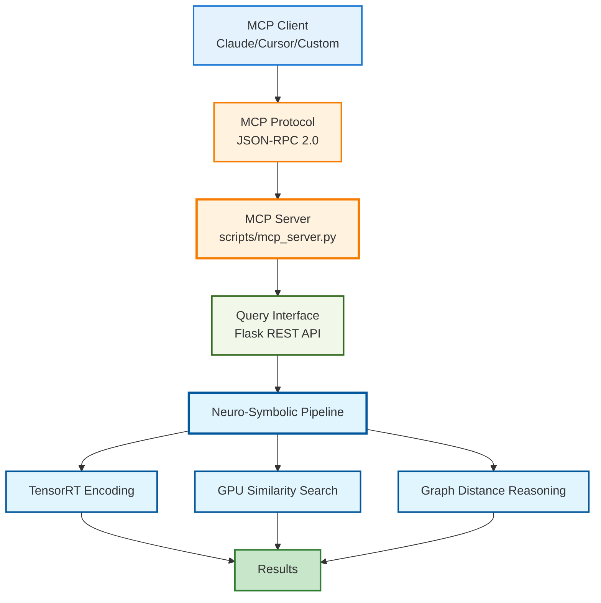

# MCP Integration Guide

Complete guide for integrating the Neuro-Symbolic Recommender with Model Context Protocol (MCP) servers and clients.

---

## Table of Contents

1. [Overview](#overview)
2. [Server Integration](#server-integration)
3. [Client Integration](#client-integration)
4. [Advanced Features](#advanced-features)
5. [Production Deployment](#production-deployment)
6. [Troubleshooting](#troubleshooting)

---

## Overview

The semantic recommender exposes both REST and MCP interfaces for maximum flexibility:

- **REST API**: Direct HTTP queries (port 5000)
- **MCP Server**: Protocol-based integration with Claude, cursor, etc.
- **Batch Processing**: High-throughput via dedicated batch endpoints

### Architecture

**MCP Integration Layer - Complete Stack**



**Integration Points:**
- **MCP Client**: Claude Desktop, Cursor, or custom MCP-compatible clients
- **MCP Protocol**: JSON-RPC 2.0 over stdio or HTTP
- **MCP Server**: Python-based MCP protocol handler
- **Query Interface**: Flask REST API for recommendation processing
- **Neuro-Symbolic Pipeline**: GPU-accelerated semantic search with ontology reasoning

---

## Server Integration

### Quick Start

**1. Start MCP Server**

```bash
cd semantic-recommender/scripts
source ../venv/bin/activate
python mcp_server.py
```

**2. Server Configuration**

The MCP server runs on stdio by default (for Claude/cursor integration):

```python
# scripts/mcp_server.py
MCP_SERVER_CONFIG = {
    "name": "semantic-recommender",
    "version": "2.0.0",
    "protocol": "stdio",  # or "http" for HTTP transport
    "port": 8080  # only for HTTP mode
}
```

**3. Verify Server**

```bash
# Test via stdio (simulates MCP client)
echo '{"jsonrpc":"2.0","method":"query","params":{"query":"action movies"},"id":1}' | python mcp_server.py
```

### HTTP Mode (Alternative)

For non-stdio integrations:

```bash
# Start HTTP MCP server
python mcp_server_http.py --port 8080

# Test
curl -X POST http://localhost:8080/mcp \
  -H "Content-Type: application/json" \
  -d '{
    "jsonrpc": "2.0",
    "method": "query",
    "params": {"query": "sci-fi thriller", "limit": 5},
    "id": 1
  }'
```

---

## Client Integration

### Claude Desktop

**1. Add to Claude Config**

Edit `~/Library/Application Support/Claude/claude_desktop_config.json`:

```json
{
  "mcpServers": {
    "semantic-recommender": {
      "command": "python",
      "args": [
        "/path/to/semantic-recommender/scripts/mcp_server.py"
      ],
      "env": {
        "PYTHONPATH": "/path/to/semantic-recommender",
        "CUDA_VISIBLE_DEVICES": "0"
      }
    }
  }
}
```

**2. Restart Claude Desktop**

The recommender will now be available in Claude conversations.

**3. Example Usage in Claude**

```
User: "Find me some dark psychological thrillers"

Claude: [Uses MCP to query semantic-recommender]
  → Returns: Top 5 movies with ontology reasoning
```

### Cursor Editor

**1. Add to Cursor Config**

Edit `.cursor/mcp_servers.json`:

```json
{
  "semantic-recommender": {
    "command": "python",
    "args": ["/path/to/scripts/mcp_server.py"],
    "cwd": "/path/to/semantic-recommender"
  }
}
```

**2. Use in Cursor**

```typescript
// In your code
const mcp = useMCP('semantic-recommender');
const results = await mcp.query({
  query: "mind-bending sci-fi",
  limit: 10
});
```

### Custom MCP Client

**Python Example**

```python
import json
import subprocess

def query_recommender(query: str, limit: int = 10):
    """Query via MCP stdio"""
    request = {
        "jsonrpc": "2.0",
        "method": "query",
        "params": {"query": query, "limit": limit},
        "id": 1
    }

    proc = subprocess.Popen(
        ["python", "scripts/mcp_server.py"],
        stdin=subprocess.PIPE,
        stdout=subprocess.PIPE,
        cwd="/path/to/semantic-recommender"
    )

    stdout, _ = proc.communicate(json.dumps(request).encode())
    return json.loads(stdout)

# Usage
results = query_recommender("epic fantasy adventures")
print(f"Found {len(results['result'])} movies")
```

**JavaScript Example**

```javascript
const { spawn } = require('child_process');

async function queryRecommender(query, limit = 10) {
  const mcp = spawn('python', ['scripts/mcp_server.py'], {
    cwd: '/path/to/semantic-recommender'
  });

  const request = {
    jsonrpc: '2.0',
    method: 'query',
    params: { query, limit },
    id: 1
  };

  return new Promise((resolve) => {
    mcp.stdout.on('data', (data) => {
      const response = JSON.parse(data.toString());
      resolve(response.result);
    });

    mcp.stdin.write(JSON.stringify(request));
    mcp.stdin.end();
  });
}

// Usage
const results = await queryRecommender('noir detective stories');
console.log(`Found ${results.length} movies`);
```

---

## Advanced Features

### Batch Queries via MCP

```json
{
  "jsonrpc": "2.0",
  "method": "query_batch",
  "params": {
    "queries": [
      "action thriller",
      "romantic comedy",
      "sci-fi adventure"
    ],
    "limit": 5
  },
  "id": 1
}
```

### Filtering

```json
{
  "jsonrpc": "2.0",
  "method": "query",
  "params": {
    "query": "thriller",
    "limit": 10,
    "filters": {
      "genres": ["Thriller", "Crime"],
      "min_rating": 4.0,
      "year_range": [1990, 2020]
    }
  },
  "id": 1
}
```

### Ontology Reasoning

```json
{
  "jsonrpc": "2.0",
  "method": "query",
  "params": {
    "query": "films like Inception",
    "limit": 5,
    "enable_ontology": true,
    "reasoning_mode": "graph_distance"
  },
  "id": 1
}
```

**Response includes reasoning**:

```json
{
  "jsonrpc": "2.0",
  "result": [
    {
      "title": "The Matrix",
      "score": 0.89,
      "ontology": {
        "shared_classes": [
          "movies:ComplexNarrative",
          "movies:PhilosophicalThemes"
        ],
        "graph_path": ["hasTheme", "influences"],
        "reasoning": "Connected via shared philosophical themes (2 hops)"
      }
    }
  ],
  "id": 1
}
```

---

## Production Deployment

### Systemd Service (MCP Server)

```ini
# /etc/systemd/system/semantic-recommender-mcp.service
[Unit]
Description=Semantic Recommender MCP Server
After=network.target

[Service]
Type=simple
User=recommender
WorkingDirectory=/opt/semantic-recommender
Environment="CUDA_VISIBLE_DEVICES=0"
Environment="PYTHONPATH=/opt/semantic-recommender"
ExecStart=/opt/semantic-recommender/venv/bin/python scripts/mcp_server_http.py --port 8080
Restart=always
RestartSec=10

[Install]
WantedBy=multi-user.target
```

**Enable and start**:

```bash
sudo systemctl enable semantic-recommender-mcp
sudo systemctl start semantic-recommender-mcp
sudo systemctl status semantic-recommender-mcp
```

### Docker Deployment

```dockerfile
# Dockerfile.mcp
FROM nvidia/cuda:12.4.0-runtime-ubuntu22.04

RUN apt-get update && apt-get install -y python3.13 python3-pip

WORKDIR /app
COPY . /app
RUN pip install -r scripts/requirements.txt

EXPOSE 8080

CMD ["python3", "scripts/mcp_server_http.py", "--port", "8080"]
```

**Build and run**:

```bash
docker build -f Dockerfile.mcp -t semantic-recommender-mcp .
docker run --gpus all -p 8080:8080 semantic-recommender-mcp
```

### Load Balancing Multiple MCP Servers

```nginx
# /etc/nginx/sites-available/mcp-recommender
upstream mcp_backend {
    server localhost:8080;
    server localhost:8081;
    server localhost:8082;
}

server {
    listen 80;
    server_name mcp.recommender.example.com;

    location /mcp {
        proxy_pass http://mcp_backend;
        proxy_http_version 1.1;
        proxy_set_header Connection "";
        proxy_buffering off;
    }
}
```

---

## Troubleshooting

### Issue: MCP Server Not Responding

**Symptoms**: Claude/cursor can't connect to MCP server

**Solutions**:

1. **Check server is running**:
   ```bash
   ps aux | grep mcp_server
   ```

2. **Test stdio mode**:
   ```bash
   echo '{"jsonrpc":"2.0","method":"ping","id":1}' | python scripts/mcp_server.py
   ```

3. **Check logs**:
   ```bash
   tail -f /var/log/semantic-recommender-mcp.log
   ```

### Issue: CUDA Out of Memory

**Symptoms**: MCP requests fail with GPU OOM errors

**Solutions**:

1. **Reduce batch size** in `mcp_server.py`:
   ```python
   MAX_BATCH_SIZE = 16  # Down from 32
   ```

2. **Enable multiple workers** (separate GPUs):
   ```bash
   # Terminal 1
   CUDA_VISIBLE_DEVICES=0 python mcp_server_http.py --port 8080

   # Terminal 2
   CUDA_VISIBLE_DEVICES=1 python mcp_server_http.py --port 8081
   ```

### Issue: Slow Response Times

**Symptoms**: Queries take >1 second

**Solutions**:

1. **Enable batch processor**:
   ```python
   # In query_interface.py
   use_batch = True  # Enable batching
   ```

2. **Use HTTP mode instead of stdio**:
   ```bash
   # Faster for high-throughput
   python mcp_server_http.py --port 8080
   ```

3. **Warm up TensorRT engine**:
   ```bash
   # Send warmup request on startup
   curl -X POST http://localhost:8080/warmup
   ```

### Issue: Ontology Reasoning Not Working

**Symptoms**: All ontology scores show 0.0

**Solutions**:

1. **Check genome scores loaded**:
   ```bash
   ls -lh data/processed/media/genome_scores.json
   ```

2. **Verify ontology mappings**:
   ```python
   # In Python REPL
   from scripts.utils.gpu_ontology_reasoning import GPUOntologyReasoner
   reasoner = GPUOntologyReasoner()
   print(f"Movies mapped: {len([c for c in reasoner.movie_ontology_classes.values() if c])}")
   ```

3. **Populate ontology data**:
   ```bash
   python scripts/populate_neo4j.py  # Build graph database
   ```

---

## Performance optimisation

### MCP-Specific Tuning

**1. Connection Pooling**

For HTTP mode, enable connection pooling:

```python
# mcp_server_http.py
from werkzeug.serving import WSGIRequestHandler

WSGIRequestHandler.protocol_version = "HTTP/1.1"

app.config.update(
    KEEP_ALIVE_TIMEOUT=65,
    MAX_CONTENT_LENGTH=10 * 1024 * 1024  # 10MB
)
```

**2. Request Batching**

Automatically batch requests within 50ms window:

```python
# In MCP handler
if len(pending_requests) >= 32 or time_since_first > 0.05:
    process_batch(pending_requests)
```

**3. Caching**

Cache frequent queries:

```python
from functools import lru_cache

@lru_cache(maxsize=1000)
def query_with_cache(query: str, limit: int):
    return backend.process_query(query, limit)
```

---

## API Reference

### MCP Methods

| Method | Parameters | Returns | Description |
|--------|------------|---------|-------------|
| `ping` | - | `{"status": "ok"}` | Health check |
| `query` | `query`, `limit`, `filters` | `Array<Result>` | Single query |
| `query_batch` | `queries`, `limit` | `Array<Array<Result>>` | Batch queries |
| `status` | - | `SystemStatus` | Server status |

### Result Schema

```typescript
interface Result {
  rank: number;
  id: string;
  title: string;
  score: number;  // Unified score (hybrid or semantic)
  similarity_score: number;
  hybrid_score?: number;
  metadata: {
    genres: string[];
    year: number;
    rating: number;
  };
  ontology?: {
    ontology_score: number;
    genre_score: number;
    shared_classes: string[];
    reasoning: string;
  };
}
```

---

## Examples Repository

Complete integration examples:

- **Python**: `/examples/python/mcp_client.py`
- **JavaScript**: `/examples/javascript/mcp-client.js`
- **Rust**: `/examples/rust/mcp_client.rs`
- **Claude Desktop**: `/examples/claude/config.json`
- **Cursor**: `/examples/cursor/mcp_config.json`

---

## Support

- **Documentation**: `/docs/`
- **Issues**: GitHub Issues
- **MCP Protocol**: https://modelcontextprotocol.io/
- **Claude Integration**: https://claude.ai/docs/mcp

---

**Last Updated**: 2025-12-07
**Version**: 2.0.0
**Status**: Production Ready
