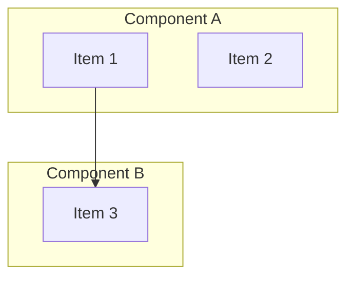
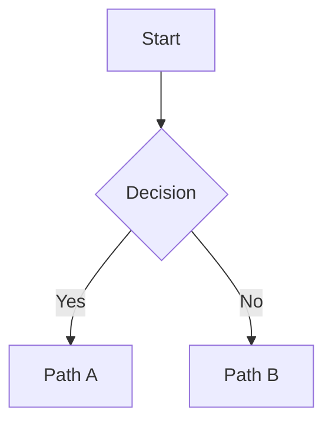
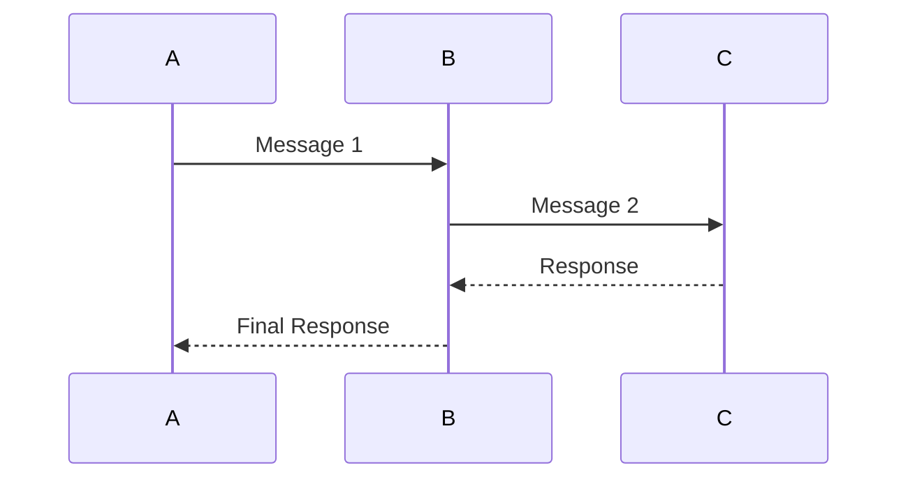

# Mermaid Diagrams - Quick Reference Guide

This document provides quick access to all Mermaid diagrams in the hackathon-tv5 documentation.

---

## Diagram Index

### 1. System Architecture Overview
**File**: `ARCHITECTURE.md` (Lines 108-145)
**Type**: Multi-layer system architecture
**View**: Shows all system components and their interactions

```
External Systems
    ↓
API Gateway Layer (REST + MCP)
    ↓
Orchestration & Routing
    ↓
├─ GPU Engine (CUDA)
└─ Vector Database (Qdrant/Milvus)
    ↓
Semantic Enrichment (Neo4j)
    ↓
Personalization & Learning (AgentDB)
```

**Key Components**:
- Content Providers, User Apps, AI Agents
- REST API & MCP Server
- Query Analyzer & Router
- GPU Engine with Tensor Cores
- HNSW Index & Metadata Filtering
- Knowledge Graph with GMC-O Ontology
- RL Agent with Thompson Sampling

---

### 2. Query Routing Decision Tree
**File**: `ARCHITECTURE.md` (Lines 174-205)
**Type**: Decision flowchart
**View**: How queries are routed to appropriate execution engine

```
Query Received
    ↓
Parse & Validate
    ↓
Estimate Candidates
    ↓
Complexity Analysis
    ↓
Decision Point:
├─ GPU Path (< 10K candidates)
├─ Vector DB Path (> 100K candidates)
└─ Hybrid Path (10K - 100K candidates)
    ↓
Deliver Results
```

**Latency Targets**:
- GPU: <10ms
- Vector DB: 20-100ms
- Hybrid: 15-50ms

---

### 3. End-to-End Query Sequence
**File**: `ARCHITECTURE.md` (Lines 217-268)
**Type**: Sequence diagram
**View**: Detailed flow of a query through the system

**Sequence**:
```
User → API Gateway (1-2ms)
    → Query Router → Embedding Generator (2-5ms)
    → Query Router: Complexity Analysis (0.1ms)
    → GPU Engine: Tensor Core Similarity (8-12ms)
    → Knowledge Graph: Semantic Enrichment (3-7ms)
    → RL Personalization: Thompson Sampling (2-5ms)
    → Response Formatting (0.5ms)
    → User (Total ~15ms p95)
```

**Participants**:
- User (actor)
- API Gateway
- Query Router
- Embedding Generator
- GPU Engine
- Knowledge Graph
- RL Personalization

---

### 4. Single-Region Deployment
**File**: `ARCHITECTURE.md` (Lines 355-393)
**Type**: Infrastructure topology
**View**: Production deployment in one region

```
Load Balancer (NGINX/HAProxy)
    ├── API Servers (3×)
    ├── GPU Nodes (N×, T4)
    └── Storage Layer
        ├── Qdrant (Sharded)
        ├── Neo4j (Replicated)
        └── Redis (Cache)
```

**Scaling**: Add more GPU nodes as needed

---

### 5. Multi-Region Global Deployment
**File**: `ARCHITECTURE.md` (Lines 398-425)
**Type**: Geographic distribution
**View**: Global deployment across regions

```
Global Routing (GeoDNS)
    ├── Region 1: US-East
    │   ├── 3× API Servers
    │   ├── 4× GPU Nodes
    │   └── Qdrant Shard 1 + Neo4j Replica 1
    │
    ├── Region 2: EU-West
    │   ├── 3× API Servers
    │   ├── 4× GPU Nodes
    │   └── Qdrant Shard 2 + Neo4j Replica 2
    │
    └── Region 3: APAC
        ├── 3× API Servers
        ├── 4× GPU Nodes
        └── Qdrant Shard 3 + Neo4j Replica 3

Data Replication: US-East ↔ EU-West ↔ APAC
```

---

## Using These Diagrams

### In GitHub
1. Go to the relevant `.md` file
2. Scroll to the section with the diagram
3. GitHub automatically renders Mermaid diagrams in markdown

### In Other Tools
- **VS Code**: Install Markdown Preview Mermaid Support extension
- **Obsidian**: Mermaid diagrams render natively
- **GitLab**: Renders like GitHub
- **Online**: Use https://mermaid.live/

### Editing Diagrams
1. Copy the diagram code
2. Modify in https://mermaid.live/
3. Update the markdown file
4. Test rendering on GitHub

---

## Color Scheme Reference

All diagrams use a consistent color palette:

| Layer | Background | Border | Purpose |
|-------|-----------|--------|---------|
| External Systems | Light Blue (#e3f2fd) | Dark Blue (#1976d2) | External sources |
| Gateway Layer | Light Orange (#fff3e0) | Dark Orange (#f57c00) | API entry points |
| Orchestration | Light Purple (#f3e5f5) | Dark Purple (#7b1fa2) | Decision logic |
| GPU Engine | Light Orange (#ffe0b2) | Dark Orange (#e65100) | GPU compute |
| Vector Database | Light Green (#c8e6c9) | Dark Green (#388e3c) | Storage |
| Enrichment | Light Yellow (#f0f4c3) | Dark Yellow (#827717) | Semantic processing |
| Learning | Light Red (#ffccbc) | Dark Red (#d84315) | Personalization |

---

## Common Mermaid Patterns Used

### Subgraphs (for grouping)


### Decision Flows


### Sequences


---

## Diagram Statistics

| Diagram | Type | Nodes | Connections | Complexity |
|---------|------|-------|-------------|-----------|
| System Context | graph TD | 20+ | 25+ | High |
| Query Routing | flowchart | 8 | 9 | Medium |
| Query Sequence | sequenceDiagram | 7 participants | 8 interactions | Medium |
| Deployment | graph TD | 12 | 10 | Medium |
| Multi-Region | graph LR | 5 | 4 | Low |

---

## Best Practices for Mermaid

### Do's
✅ Use descriptive node labels
✅ Keep diagrams focused (one concept per diagram)
✅ Use consistent naming conventions
✅ Add styling for visual hierarchy
✅ Test rendering on GitHub

### Don'ts
❌ Don't make diagrams too large (>30 nodes)
❌ Don't use special characters in node IDs
❌ Don't nest subgraphs too deeply
❌ Don't use conflicting node IDs
❌ Don't assume styling will render identically everywhere

---

## Troubleshooting

### Diagram Not Rendering?
1. Check syntax: https://mermaid.live/
2. Ensure proper markdown fence: `\`\`\`mermaid`
3. Verify node IDs are unique
4. Check for unclosed brackets/quotes
5. Refresh GitHub page

### Styling Issues?
1. Use hex colors (#RRGGBB format)
2. Check Mermaid syntax for styling
3. Test in https://mermaid.live/
4. Ensure stroke-width has 'px' unit

### Performance Issues?
1. Reduce number of nodes
2. Simplify connections
3. Break into multiple diagrams
4. Use flowchart instead of complex graph

---

## Resources

- **Official Mermaid Docs**: https://mermaid.js.org/
- **Live Editor**: https://mermaid.live/
- **Syntax Guide**: https://mermaid.js.org/syntax/graph.html
- **GitHub Integration**: https://docs.github.com/en/get-started/writing-on-github/working-with-advanced-formatting/creating-diagrams
- **Examples**: https://mermaid.js.org/ecosystem/integrations.html

---

## Maintenance

### Adding New Diagrams
1. Use https://mermaid.live/ to design
2. Copy code to markdown file
3. Add reference to this guide
4. Test on GitHub
5. Document in MERMAID_CONVERSION_REPORT.md

### Updating Existing Diagrams
1. Edit in https://mermaid.live/
2. Update markdown file
3. Verify rendering on GitHub
4. Update MERMAID_CONVERSION_REPORT.md

### Version Control
- Always commit markdown files, not generated images
- Mermaid diagrams are rendered on-the-fly by GitHub
- No image bloat in repository

---

**Last Updated**: 2025-12-06
**Status**: All diagrams validated and ready for GitHub
